# OpenGPGPU 架构全景详解

> **面向普通用户的综合架构说明文档**
>
> OpenGPGPU 是一个开源的全栈 GPGPU（通用图形处理器）架构模型，采用 Chisel 硬件构建语言实现。
> 本文从宏观到微观，系统性地介绍其设计哲学、层级结构、指令流水线、执行引擎与存储子系统。

---

## 目录

1. [架构概述与设计哲学](#1-架构概述与设计哲学)
2. [四层硬件层级结构](#2-四层硬件层级结构)
3. [指令集架构（ISA）概览](#3-指令集架构isa概览)
4. [SMSP 微架构与指令流水线](#4-smsp-微架构与指令流水线)
5. [SM 级协同与任务调度](#5-sm-级协同与任务调度)
6. [执行引擎与异构寄存器堆](#6-执行引擎与异构寄存器堆)
7. [存储子系统与缓存层级](#7-存储子系统与缓存层级)
8. [全异步张量流引擎](#8-全异步张量流引擎)
9. [K-Loop 软件流水线](#9-k-loop-软件流水线)
10. [总结与展望](#10-总结与展望)

---

## 1. 架构概述与设计哲学

### 1.1 什么是 OpenGPGPU？

OpenGPGPU 是一个面向 AI 计算与通用并行计算的开源 GPGPU 架构。它从零开始设计，旨在探索一种 **宏数据流（Macro-Dataflow）** 执行模型——将传统的 SIMT（单指令多线程）与异步数据流执行相结合，实现更高的计算效率与存储带宽利用率。

### 1.2 核心设计理念

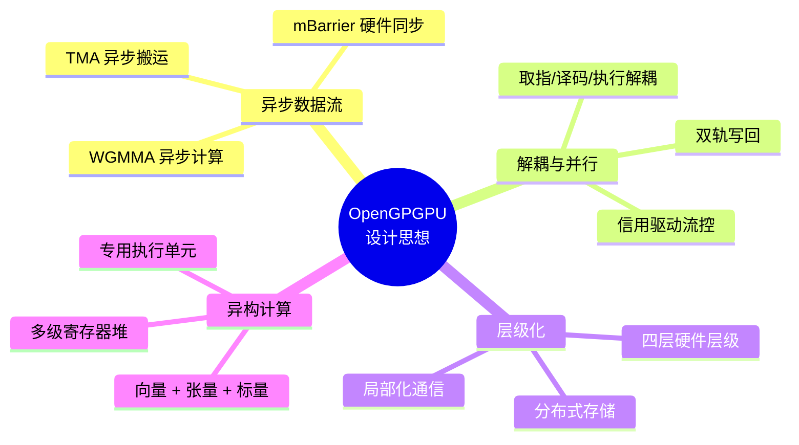
```mermaid
mindmap
  root((OpenGPGPU<br/>设计思想))
    异步数据流
      TMA 异步搬运
      mBarrier 硬件同步
      WGMMA 异步计算
    解耦与并行
      取指/译码/执行解耦
      信用驱动流控
      双轨写回
    层级化
      四层硬件层级
      分布式存储
      局部化通信
    异构计算
      向量 + 张量 + 标量
      多级寄存器堆
      专用执行单元
```

- **宏数据流（Macro-Dataflow）**：将计算图分解为粗粒度的异步任务，通过硬件同步原语（mBarrier）协调数据依赖，而非传统的锁或软件同步。
- **解耦流水线（Decoupled Pipeline）**：指令的取指、译码、发射、执行、写回各阶段通过信用计数器（Credit Counter）和队列解耦，允许各阶段独立运行，最大化吞吐。
- **异构存储层次（Heterogeneous Memory Hierarchy）**：针对不同数据类型（向量、标量、谓词、累加器）设计专用的寄存器文件，配合多级缓存，减少端口争用。

### 1.3 与传统 GPU 架构的对比

| 特性 | 传统 GPU（如 NVIDIA） | OpenGPGPU |
|------|----------------------|------------|
| 执行模型 | SIMT（锁步） | 宏数据流 + SIMT |
| 同步机制 | 软件屏障 + __syncthreads | 硬件 mBarrier |
| 张量计算 | 内积（Dot Product） | 外积（Outer Product） |
| 数据搬运 | 同步 Load/Store | 异步 TMA |
| 寄存器堆 | 统一寄存器文件 | 异构多级寄存器堆 |
| 取指控制 | 简单 PC 顺序 | 信用驱动 + 双线译码 |

---

## 2. 四层硬件层级结构

OpenGPGPU 采用 **四层物理层级** 组织计算资源，从最小的执行单元到完整的芯片：

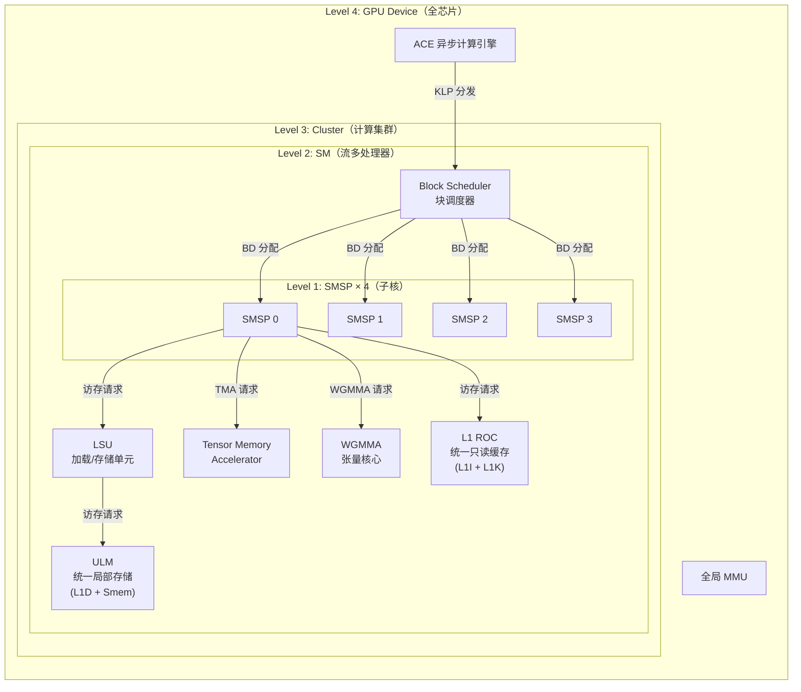
```mermaid
graph TB
    subgraph "Level 4: GPU Device（全芯片）"
        direction TB
        ACE[ACE 异步计算引擎]
        GMMU[全局 MMU]
        
        subgraph "Level 3: Cluster（计算集群）"
            direction TB
            
            subgraph "Level 2: SM（流多处理器）"
                direction TB
                BS[Block Scheduler<br/>块调度器]
                ROC["L1 ROC<br/>统一只读缓存<br/>(L1I + L1K)"]
                LSU[LSU<br/>加载/存储单元]
                ULM["ULM<br/>统一局部存储<br/>(L1D + Smem)"]
                TMA[Tensor Memory<br/>Accelerator]
                WGMMA[WGMMA<br/>张量核心]
                
                subgraph "Level 1: SMSP × 4（子核）"
                    SMSP0[SMSP 0]
                    SMSP1[SMSP 1]
                    SMSP2[SMSP 2]
                    SMSP3[SMSP 3]
                end
            end
        end
    end

    ACE -->|KLP 分发| BS
    BS -->|BD 分配| SMSP0
    BS -->|BD 分配| SMSP1
    BS -->|BD 分配| SMSP2
    BS -->|BD 分配| SMSP3
    SMSP0 -->|访存请求| LSU
    SMSP0 -->|TMA 请求| TMA
    SMSP0 -->|WGMMA 请求| WGMMA
    SMSP0 -->|访存请求| ROC 
    LSU -->|访存请求| ULM
```

### 2.1 Level 1: SMSP（子核 / Sub-Core）

SMSP（Streaming Multiprocessor Sub-Partition）是 OpenGPGPU 中 **最小的独立指令执行单元**。每个 SMSP 包含：

- **指令前端**：IFU（取指单元）、L0 I-Cache（指令缓存）、Decoder（译码器）、L0 K-Cache（常量缓存）、I-Buffer（指令缓冲区）
- **调度与发射**：Warp Scheduler（线程束调度器）、Scoreboard（记分板）、Operand Collector（操作数搜集器）
- **执行单元**：vALU（向量算术逻辑单元）、BRU（分支单元）、LSU（加载/存储单元）
- **写回单元**：RCB（结果提交缓冲区）
- **寄存器文件**：vGPR（向量通用寄存器）、uGPR（标量寄存器）、pGPR（谓词寄存器）、aGPR（累加器寄存器）

每个 SMSP 管理 **8 个 Warp（线程束）**，每个 Warp 包含 **32 个线程**。

### 2.2 Level 2: SM（流多处理器 / Streaming Multiprocessor）

SM 是 OpenGPGPU 的 **核心计算节点**，包含：

- **1 个 Block Scheduler（块调度器）**：负责从 ACE 接收 Block Descriptor，分配资源，初始化 Warp，管理生命周期
- **4 个 SMSP 子核**：并行执行 32 个 Warp（4 × 8）
- **共享资源**：
  - L1 D-Cache（一级数据缓存）
  - TMA（张量内存加速器）
  - WGMMA（Warp-Group 矩阵乘累加单元）
  - LSU 共享内存（SMAC）
  - ROC 路由器接口

### 2.3 Level 3: Cluster（计算集群）

多个 SM 通过 **片上互联网络** 组成 Cluster。Cluster 内部实现：

- **SM 间通信**：通过共享 L2 缓存或直接互联
- **全局内存一致性**：由 MOU（内存排序单元）在 Cluster 范围内维护
- **分布式屏障**：跨 SM 的 mBarrier 同步

### 2.4 Level 4: Device（全芯片）

完整的 GPU 芯片包含：

- **ACE（异步计算引擎）**：全局任务分发器，负责 Grid → Block → Warp 的三级分解
- **GMMU（全局内存管理单元）**：地址翻译与页表管理
- **多级缓存系统**：L0 → L1 → L2 → HBM/GDDR

---

## 3. 指令集架构（ISA）概览

### 3.1 指令编码

OpenGPGPU 采用 **128 位固定长度指令编码**：

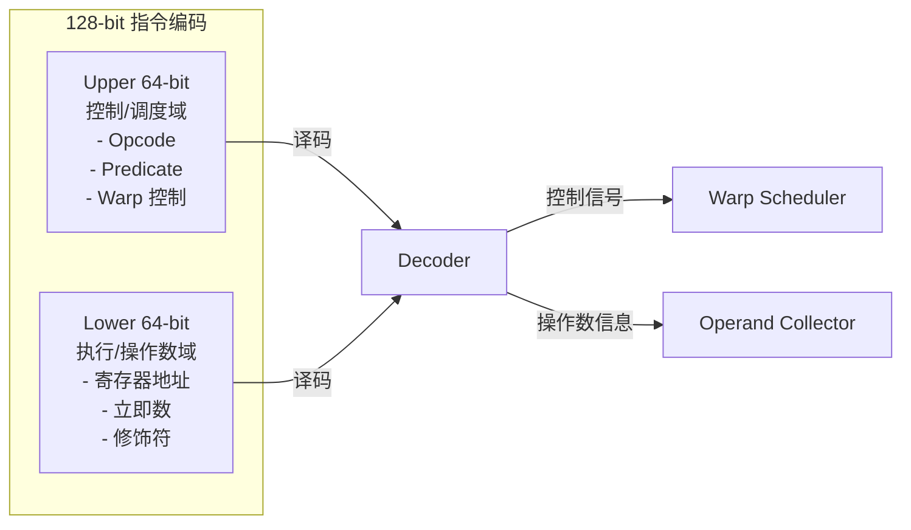
```mermaid
graph LR
    subgraph "128-bit 指令编码"
        UPPER["Upper 64-bit<br/>控制/调度域<br/>- Opcode<br/>- Predicate<br/>- Warp 控制"]
        LOWER["Lower 64-bit<br/>执行/操作数域<br/>- 寄存器地址<br/>- 立即数<br/>- 修饰符"]
    end

    UPPER -->|译码| DEC[Decoder]
    LOWER -->|译码| DEC
    DEC -->|控制信号| SCHED[Warp Scheduler]
    DEC -->|操作数信息| OC[Operand Collector]
```

### 3.2 指令分类

OpenGPGPU MVP ISA 包含 **27 条核心指令**，分为 5 个子系统：

| 类别 | 指令 | 功能 |
|------|------|------|
| **异步访存搬运** | `TMA` | 张量内存异步搬运 |
| | `LDS` | 共享内存加载 |
| | `STS` | 共享内存存储 |
| | `LDG` | 全局内存加载 |
| | `STG` | 全局内存存储 |
| | `LDC` | 常量内存加载 |
| **硬件同步** | `mBarrier` | 硬件屏障分配/到达/等待 |
| | `CP.ASYNC` | 异步拷贝 |
| | `CP.WAIT` | 异步拷贝等待 |
| **张量计算** | `WGMMA` | Warp-Group 矩阵乘累加 |
| | `V2A` | 向量→累加器搬运 |
| | `A2V` | 累加器→向量搬运 |
| | `MMA.PREFETCH` | 矩阵操作数预取 |
| **控制流** | `BAR.SYNC` | 线程束屏障同步 |
| | `WBRA` | Warp 级条件分支 |
| | `EXIT` | 线程退出 |
| | `SSY` | 栈帧同步 |
| **整数/浮点** | `IADD`, `IMAD` | 整数加减/乘累加 |
| | `FADD`, `FMAD` | 浮点加减/乘累加 |
| | `ISETP` | 整数比较置谓词 |
| | `MOV` | 寄存器移动/特殊寄存器读 |
| | `S2R` | 特殊寄存器→寄存器 |
| | `I2F`, `F2I` | 整数/浮点转换 |
| | `SHFL` | 线程束内数据交换 |

### 3.3 指令生命周期

一条指令从取指到写回经历以下阶段：

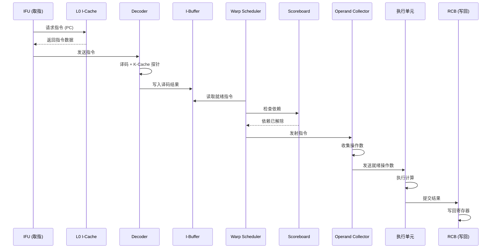
```mermaid
sequenceDiagram
    participant IFU as IFU (取指)
    participant IC as L0 I-Cache
    participant DEC as Decoder
    participant IB as I-Buffer
    participant WS as Warp Scheduler
    participant SB as Scoreboard
    participant OC as Operand Collector
    participant EX as 执行单元
    participant RCB as RCB (写回)

    IFU->>IC: 请求指令 (PC)
    IC-->>IFU: 返回指令数据
    IFU->>DEC: 发送指令
    DEC->>DEC: 译码 + K-Cache 探针
    DEC->>IB: 写入译码结果
    WS->>IB: 读取就绪指令
    WS->>SB: 检查依赖
    SB-->>WS: 依赖已解除
    WS->>OC: 发射指令
    OC->>OC: 收集操作数
    OC->>EX: 发送就绪操作数
    EX->>EX: 执行计算
    EX->>RCB: 提交结果
    RCB->>RCB: 写回寄存器
```

---

## 4. SMSP 微架构与指令流水线

### 4.1 SMSP 内部架构全景

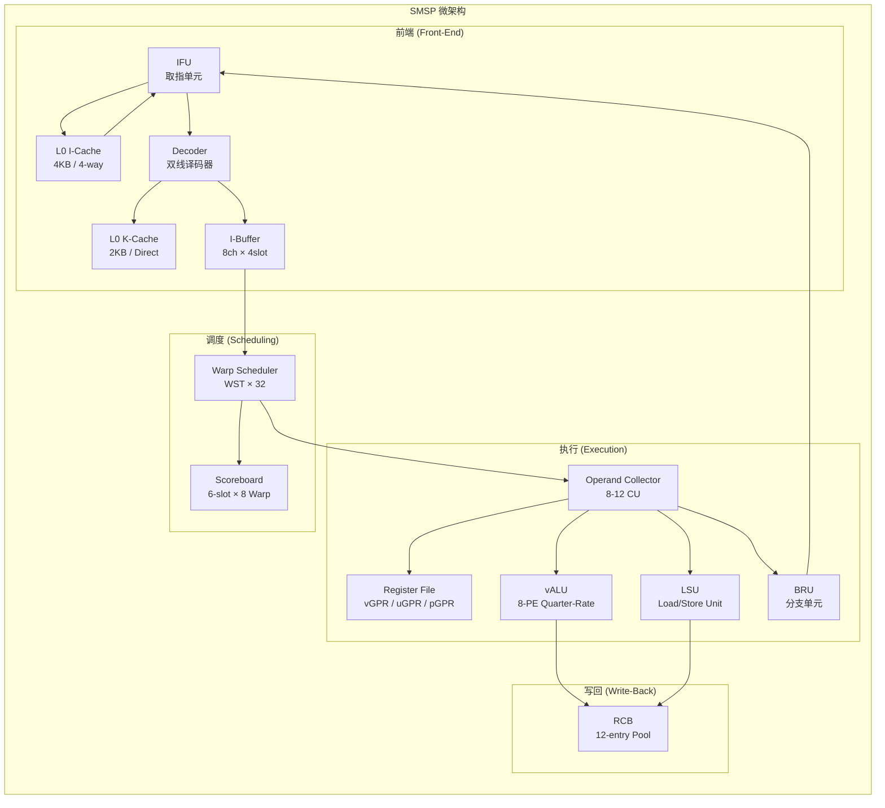
```mermaid
graph TB
    subgraph "SMSP 微架构"
        direction TB
        
        subgraph "前端 (Front-End)"
            IFU[IFU<br/>取指单元]
            IC[L0 I-Cache<br/>4KB / 4-way]
            DEC[Decoder<br/>双线译码器]
            KC[L0 K-Cache<br/>2KB / Direct]
            IB[I-Buffer<br/>8ch × 4slot]
        end
        
        subgraph "调度 (Scheduling)"
            WS[Warp Scheduler<br/>WST × 32]
            SB[Scoreboard<br/>6-slot × 8 Warp]
        end
        
        subgraph "执行 (Execution)"
            OC[Operand Collector<br/>8-12 CU]
            RF[Register File<br/>vGPR / uGPR / pGPR]
            vALU[vALU<br/>8-PE Quarter-Rate]
            LSU[LSU<br/>Load/Store Unit]
            BRU[BRU<br/>分支单元]
        end
        
        subgraph "写回 (Write-Back)"
            RCB[RCB<br/>12-entry Pool]
        end

        IFU --> IC
        IC --> IFU
        IFU --> DEC
        DEC --> KC
        DEC --> IB
        IB --> WS
        WS --> SB
        WS --> OC
        OC --> RF
        OC --> vALU
        OC --> LSU
        OC --> BRU
        vALU --> RCB
        LSU --> RCB
        BRU --> IFU
    end
```

### 4.2 前端：信用驱动的取指闭环

#### 4.2.1 IFU（取指单元）

IFU 负责为 8 个 Warp 生成取指请求，核心机制：

- **PST（PC 状态表）**：8 个条目，每个 Warp 一个，记录 PC、状态（Active/Stall/Sleep/Exit）
- **信用掩码轮询仲裁**：带信用掩码的 Round-Robin 仲裁，只选择有 I-Buffer 空间的 Warp
- **分支重定向**：BRU 执行分支指令后，通过 Flush + Generation Tag 机制刷新流水线

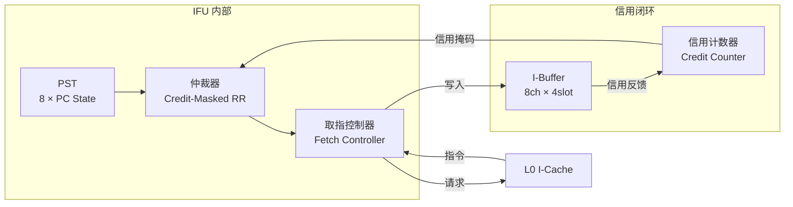
```mermaid
graph LR
    subgraph "IFU 内部"
        PST[PST<br/>8 × PC State]
        ARB[仲裁器<br/>Credit-Masked RR]
        FC[取指控制器<br/>Fetch Controller]
    end
    
    subgraph "信用闭环"
        IB[I-Buffer<br/>8ch × 4slot]
        CR[信用计数器<br/>Credit Counter]
    end

    PST --> ARB
    ARB --> FC
    FC -->|请求| ICACHE[L0 I-Cache]
    ICACHE -->|指令| FC
    FC -->|写入| IB
    IB -->|信用反馈| CR
    CR -->|信用掩码| ARB
```

#### 4.2.2 Decoder（译码器）

Decoder 采用 **双线异步操作**：

- **Compute Track（计算轨）**：主译码路径，解析指令类型、操作数、谓词
- **Snoop Track（嗅探轨）**：提前向 L0 K-Cache 发送常量访问请求，隐藏访存延迟

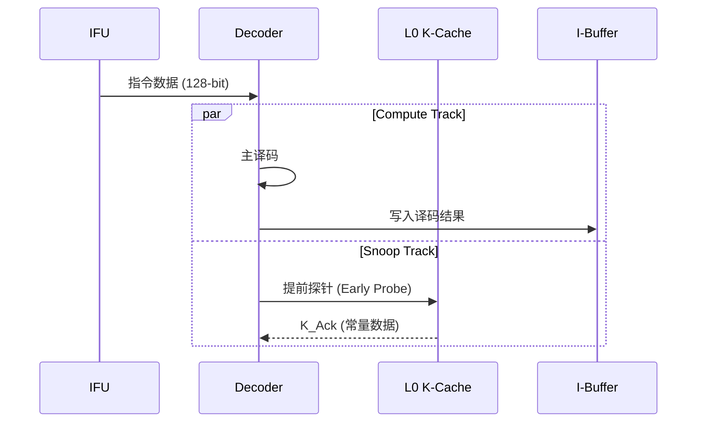
```mermaid
sequenceDiagram
    participant IFU as IFU
    participant DEC as Decoder
    participant KC as L0 K-Cache
    participant IB as I-Buffer

    IFU->>DEC: 指令数据 (128-bit)
    par Compute Track
        DEC->>DEC: 主译码
        DEC->>IB: 写入译码结果
    and Snoop Track
        DEC->>KC: 提前探针 (Early Probe)
        KC-->>DEC: K_Ack (常量数据)
    end
```

#### 4.2.3 I-Buffer（指令缓冲区）

I-Buffer 是 **8 通道 × 4 槽位** 的矩阵结构，每个 Warp 一个通道：

- **写入端**：Decoder 写入译码后的指令
- **读出端**：Warp Scheduler 读取就绪指令
- **信用反馈**：空槽位计数反馈给 IFU，形成信用闭环

### 4.3 调度：Warp Scheduler 与 Scoreboard

#### 4.3.1 Warp Scheduler（线程束调度器）

Warp Scheduler 是 SMSP 的 **调度核心**，管理 32 个 Warp 状态（WST）：

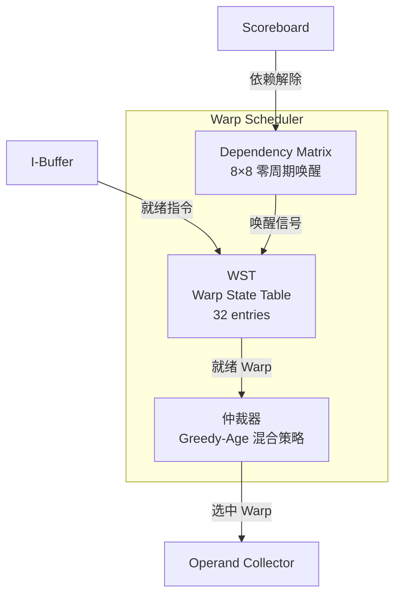
```mermaid
graph TB
    subgraph "Warp Scheduler"
        WST[WST<br/>Warp State Table<br/>32 entries]
        ARB[仲裁器<br/>Greedy-Age 混合策略]
        DM[Dependency Matrix<br/>8×8 零周期唤醒]
    end

    IB[I-Buffer] -->|就绪指令| WST
    WST -->|就绪 Warp| ARB
    ARB -->|选中 Warp| OC[Operand Collector]
    DM -->|唤醒信号| WST
    SB[Scoreboard] -->|依赖解除| DM
```

**调度策略**：

- **Greedy 模式**：优先执行同一 Warp 的连续指令，提高缓存局部性
- **Age 模式**：当 Greedy 遇到长延迟操作时，切换到 Age 模式，公平调度其他 Warp
- **混合策略**：动态切换，兼顾吞吐与公平

#### 4.3.2 Scoreboard（记分板）

Scoreboard 管理 **长延迟指令的依赖跟踪**：

- **6 槽位设计**：每个 Warp 最多 6 个未完成的 LSU/SFU 指令
- **两阶段交互**：
  1. **Initial Check**：发射前检查目标寄存器是否被之前指令占用
  2. **Wakeup**：执行完成后异步推送唤醒信号
- **与 mBarrier 的区别**：Scoreboard 是 **intra-warp（束内）** 依赖跟踪，mBarrier 是 **inter-warp/system（束间/系统级）** 同步

### 4.4 执行：Operand Collector 与 vALU

#### 4.4.1 Operand Collector（操作数搜集器）

OC 是 **乱序发射站**，负责：

- **Collector Units（CU）池**：8-12 个 CU，每个 CU 等待一个 Warp 指令的所有操作数就绪
- **Bank Arbiter**：解析 vGPR 的 4-bank 冲突，仲裁读取顺序
- **Bypass Network**：RCB 的 CAM 旁路网络，直接转发刚计算完的结果

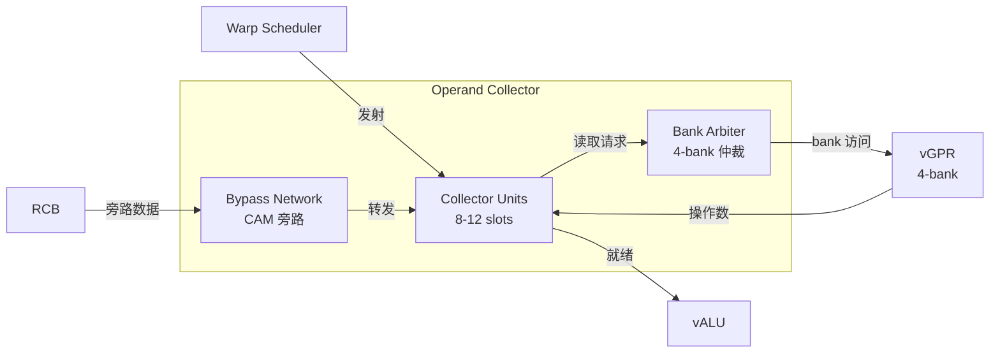
```mermaid
graph LR
    subgraph "Operand Collector"
        CU[Collector Units<br/>8-12 slots]
        BA[Bank Arbiter<br/>4-bank 仲裁]
        BN[Bypass Network<br/>CAM 旁路]
    end

    WS[Warp Scheduler] -->|发射| CU
    CU -->|读取请求| BA
    BA -->|bank 访问| vGPR[vGPR<br/>4-bank]
    vGPR -->|操作数| CU
    RCB[RCB] -->|旁路数据| BN
    BN -->|转发| CU
    CU -->|就绪| vALU[vALU]
```

#### 4.4.2 vALU（向量算术逻辑单元）

vALU 采用 **Quarter-Rate（四分之一速率）** 架构：

- **8 个 PE（处理单元）**：每个 PE 处理 4 个线程，32 线程的 Warp 需要 4 个节拍（Beat）
- **4 级流水线**：
  - **EX1**：取数解复用、节拍分片、指令译码
  - **EX2**：逻辑运算、浮点预处理、乘法阵列
  - **EX3**：算术合并、加法树、前导零预测
  - **EX4**：规格化、舍入、谓词遮蔽、结果组装

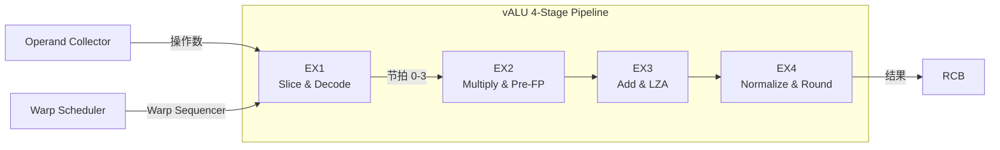
```mermaid
graph LR
    subgraph "vALU 4-Stage Pipeline"
        EX1["EX1<br/>Slice & Decode"]
        EX2["EX2<br/>Multiply & Pre-FP"]
        EX3["EX3<br/>Add & LZA"]
        EX4["EX4<br/>Normalize & Round"]
    end

    OC[Operand Collector] -->|操作数| EX1
    EX1 -->|节拍 0-3| EX2
    EX2 --> EX3
    EX3 --> EX4
    EX4 -->|结果| RCB[RCB]
    
    WS[Warp Scheduler] -->|Warp Sequencer| EX1
```

**Warp Sequencer（节拍序列器）**：控制 4 个节拍的发射，每个节拍处理 8 个线程的数据。

### 4.5 写回：RCB（结果提交缓冲区）

RCB 是 **写回冲击吸收器**，解决执行单元与寄存器文件之间的速率不匹配：

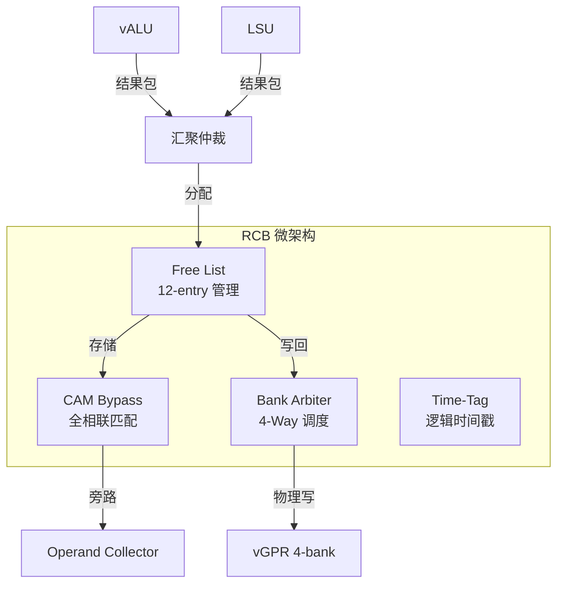
```mermaid
graph TB
    subgraph "RCB 微架构"
        FL[Free List<br/>12-entry 管理]
        CAM[CAM Bypass<br/>全相联匹配]
        BA[Bank Arbiter<br/>4-Way 调度]
        TT[Time-Tag<br/>逻辑时间戳]
    end

    vALU[vALU] -->|结果包| INGRESS[汇聚仲裁]
    LSU[LSU] -->|结果包| INGRESS
    INGRESS -->|分配| FL
    FL -->|存储| CAM
    CAM -->|旁路| OC[Operand Collector]
    FL -->|写回| BA
    BA -->|物理写| vGPR[vGPR 4-bank]
```

**关键特性**：

- **双轨同步**：LSU 结果可提前释放（early release），vALU 结果延迟释放（late release）
- **CAM 旁路**：单周期全相联匹配，实现零延迟数据转发
- **4-Way Bank Arbiter**：平滑写回 4-bank vGPR 的物理写端口

---

## 5. SM 级协同与任务调度

### 5.1 ACE → Block Scheduler → SMSP 任务分发

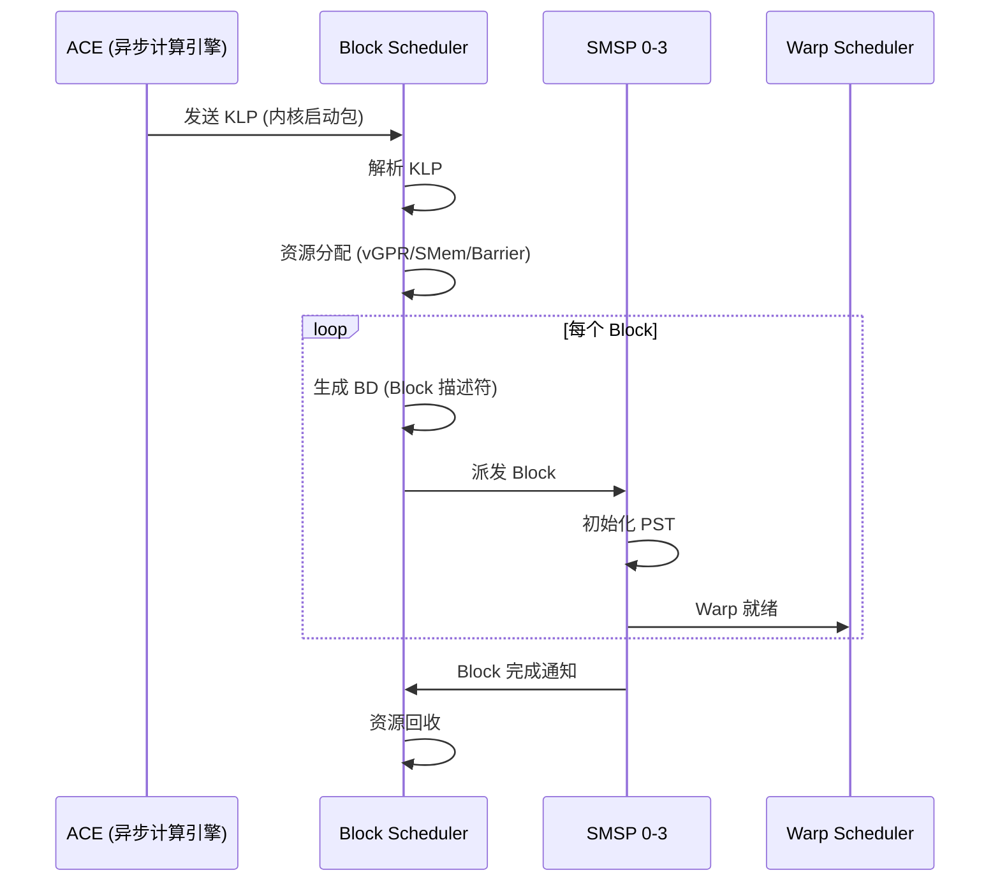
```mermaid
sequenceDiagram
    participant ACE as ACE (异步计算引擎)
    participant BS as Block Scheduler
    participant SMSP0 as SMSP 0-3
    participant WS as Warp Scheduler

    ACE->>BS: 发送 KLP (内核启动包)
    BS->>BS: 解析 KLP
    BS->>BS: 资源分配 (vGPR/SMem/Barrier)
    loop 每个 Block
        BS->>BS: 生成 BD (Block 描述符)
        BS->>SMSP0: 派发 Block
        SMSP0->>SMSP0: 初始化 PST
        SMSP0->>WS: Warp 就绪
    end
    SMSP0->>BS: Block 完成通知
    BS->>BS: 资源回收
```

### 5.2 Block Scheduler（块调度器）

Block Scheduler 是 SM 的 **任务管理核心**：

- **资源分配**：使用 Bitmap 状态机管理 vGPR、SMem、Barrier 池的分配
- **Warp 裂变（Fission）**：将 Block 的线程分配到多个 Warp，初始化 PST
- **硬件屏障池**：16 个硬件屏障槽位，支持 mBarrier 分配
- **生命周期管理**：引用计数器跟踪活跃 Block，异步资源释放

### 5.3 ACE（异步计算引擎）

ACE 是 **全局任务分发器**：

- **Command Fetcher**：通过门铃（Doorbell）机制从 Host 接收命令
- **KLP Parser**：解析内核启动包（64B），提取 Grid 维度、资源需求
- **GDU（Grid Dispatch Unit）**：三维嵌套计数器，将 Grid 展开为 Block
- **RMU（资源管理单元）**：全局 Scoreboard 跟踪各 SM 的资源使用

---

## 6. 执行引擎与异构寄存器堆

### 6.1 异构多级寄存器堆

OpenGPGPU 设计了 **四种专用寄存器文件**，针对不同数据类型优化：

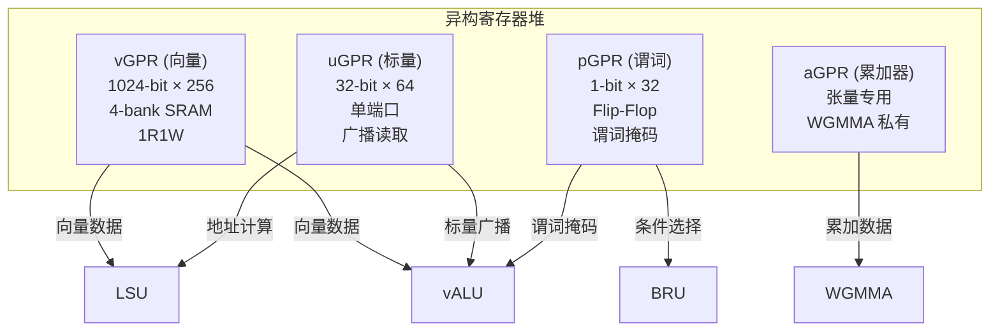
```mermaid
graph TB
    subgraph "异构寄存器堆"
        vGPR["vGPR (向量)<br/>1024-bit × 256<br/>4-bank SRAM<br/>1R1W"]
        uGPR["uGPR (标量)<br/>32-bit × 64<br/>单端口<br/>广播读取"]
        pGPR["pGPR (谓词)<br/>1-bit × 32<br/>Flip-Flop<br/>谓词掩码"]
        aGPR["aGPR (累加器)<br/>张量专用<br/>WGMMA 私有"]
    end

    vGPR -->|向量数据| vALU[vALU]
    vGPR -->|向量数据| LSU[LSU]
    uGPR -->|标量广播| vALU
    uGPR -->|地址计算| LSU
    pGPR -->|谓词掩码| vALU
    pGPR -->|条件选择| BRU[BRU]
    aGPR -->|累加数据| WGMMA[WGMMA]
```

| 寄存器类型 | 位宽 | 数量 | 物理实现 | 用途 |
|-----------|------|------|---------|------|
| **vGPR** | 1024-bit | 256 | 4-bank SRAM | 向量操作数（32线程 × 32-bit） |
| **uGPR** | 32-bit | 64 | 单端口 SRAM | 标量/地址/常量广播 |
| **pGPR** | 1-bit | 32 | Flip-Flop | 谓词掩码/条件选择 |
| **aGPR** | 张量专用 | - | WGMMA 私有 | 矩阵累加器 |

### 6.2 vGPR 的 4-Bank 交织

vGPR 采用 **模 4 交织映射**，将连续的 32 位寄存器分散到 4 个 Bank：

```
Bank 0: 寄存器 0, 4, 8, 12, ...
Bank 1: 寄存器 1, 5, 9, 13, ...
Bank 2: 寄存器 2, 6, 10, 14, ...
Bank 3: 寄存器 3, 7, 11, 15, ...
```

这种交织与 Warp 的 32 线程 × 32-bit 的 vGPR 行宽天然匹配——读取一个完整的 vGPR 行需要 4 个 Bank 各贡献 256-bit，恰好是 4 个节拍（Beat）的读取量。

### 6.3 vALU 的 Quarter-Rate 架构

vALU 的 Quarter-Rate 设计意味着：

- **物理 PE 数**：8 个 PE（而非 32 个）
- **处理一个 Warp**：需要 4 个时钟周期（4 个 Beat）
- **优势**：面积和功耗降低 75%，而吞吐量仅降低 25%（通过流水线重叠补偿）

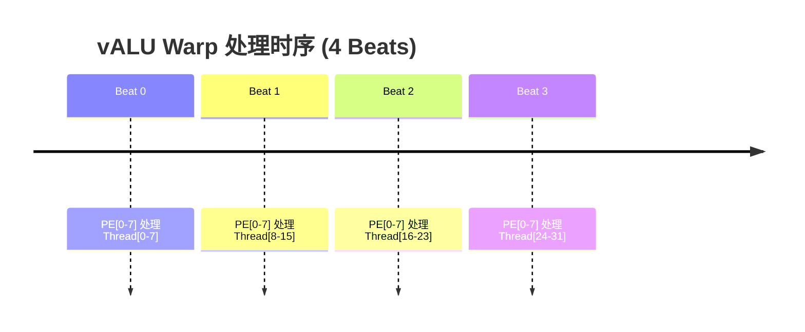
```mermaid
timeline
    title vALU Warp 处理时序 (4 Beats)
    Beat 0 : PE[0-7] 处理 Thread[0-7]
    Beat 1 : PE[0-7] 处理 Thread[8-15]
    Beat 2 : PE[0-7] 处理 Thread[16-23]
    Beat 3 : PE[0-7] 处理 Thread[24-31]
```

---

## 7. 存储子系统与缓存层级

### 7.1 四级存储拓扑

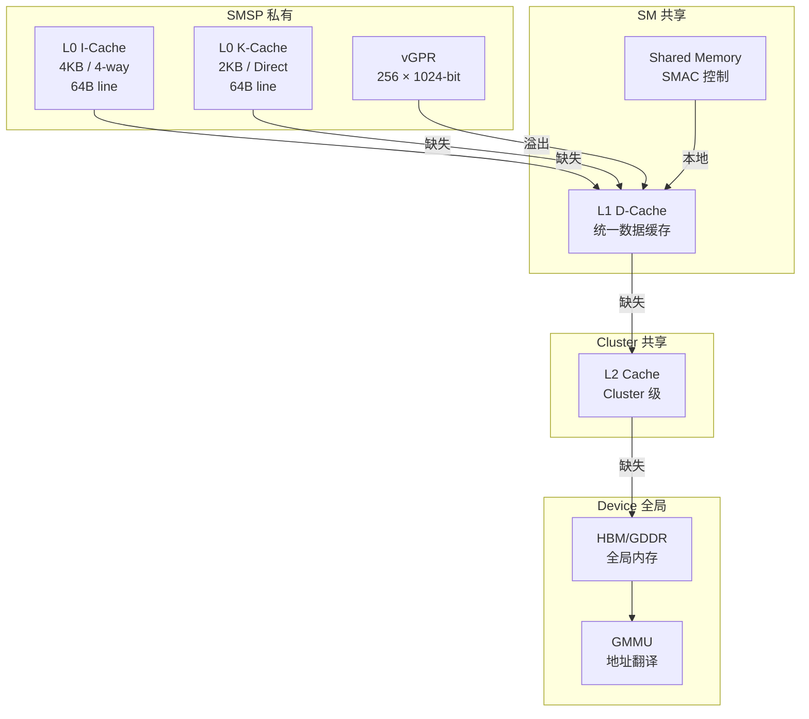
```mermaid
graph TB
    subgraph "SMSP 私有"
        L0I["L0 I-Cache<br/>4KB / 4-way<br/>64B line"]
        L0K["L0 K-Cache<br/>2KB / Direct<br/>64B line"]
        vGPR["vGPR<br/>256 × 1024-bit"]
    end

    subgraph "SM 共享"
        L1D["L1 D-Cache<br/>统一数据缓存"]
        SMEM["Shared Memory<br/>SMAC 控制"]
    end

    subgraph "Cluster 共享"
        L2["L2 Cache<br/>Cluster 级"]
    end

    subgraph "Device 全局"
        HBM["HBM/GDDR<br/>全局内存"]
        GMMU["GMMU<br/>地址翻译"]
    end

    L0I -->|缺失| L1D
    L0K -->|缺失| L1D
    vGPR -->|溢出| L1D
    L1D -->|缺失| L2
    SMEM -->|本地| L1D
    L2 -->|缺失| HBM
    HBM --> GMMU
```

### 7.2 缓存系统详解

| 缓存 | 大小 | 关联度 | 行大小 | 位置 | 用途 |
|------|------|--------|--------|------|------|
| **L0 I-Cache** | 4KB | 4-way | 64B | SMSP 私有 | 指令缓存，支持预加载 |
| **L0 K-Cache** | 2KB | Direct | 64B | SMSP 私有 | 常量缓存，Decoder 探针 |
| **L1 D-Cache** | - | - | - | SM 共享 | 统一数据缓存 |
| **L2 Cache** | - | - | - | Cluster 共享 | 二级缓存 |

### 7.3 LSU（加载/存储单元）微架构

LSU 是 OpenGPGPU 最复杂的子系统之一，负责所有访存操作：

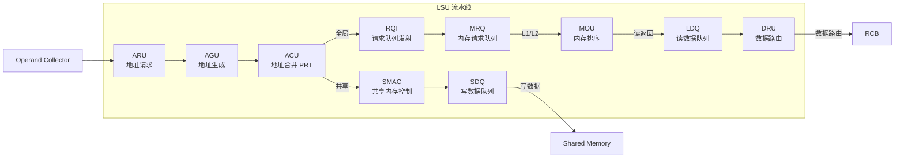
```mermaid
graph LR
    subgraph "LSU 流水线"
        ARU[ARU<br/>地址请求]
        AGU[AGU<br/>地址生成]
        ACU[ACU<br/>地址合并 PRT]
        SMAC[SMAC<br/>共享内存控制]
        RQI[RQI<br/>请求队列发射]
        MRQ[MRQ<br/>内存请求队列]
        SDQ[SDQ<br/>写数据队列]
        LDQ[LDQ<br/>读数据队列]
        MOU[MOU<br/>内存排序]
        DRU[DRU<br/>数据路由]
    end

    OC[Operand Collector] --> ARU
    ARU --> AGU
    AGU --> ACU
    ACU -->|全局| RQI
    ACU -->|共享| SMAC
    RQI --> MRQ
    MRQ -->|L1/L2| MOU
    SMAC --> SDQ
    SDQ -->|写数据| SMEM[Shared Memory]
    MOU -->|读返回| LDQ
    LDQ --> DRU
    DRU -->|数据路由| RCB[RCB]
```

**关键特性**：

- **PRT 地址合并**：将 32 个线程的分散地址合并为最少的内存请求，4 步流水线
- **SMAC 共享内存控制**：Bank 冲突检测与重放，支持 TMA/WGMMA 多主访问
- **LDC 广播**：常量加载的 1-to-32 广播树
- **MOU 内存排序**：4 个 Scope（.cta/.cluster/.gpu/.sys）的一致性维护
- **DRU 数据路由**：TID 匹配的逆数据分发

---

## 8. 全异步张量流引擎

### 8.1 三引擎协同架构

OpenGPGPU 最核心的创新是 **TMA + mBarrier + WGMMA** 三引擎异步协同：

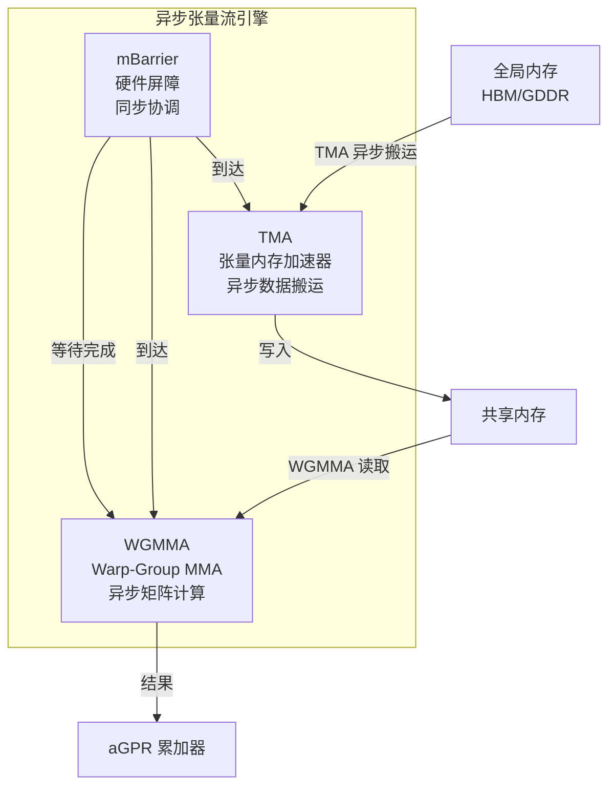
```mermaid
graph TB
    subgraph "异步张量流引擎"
        TMA["TMA<br/>张量内存加速器<br/>异步数据搬运"]
        MB["mBarrier<br/>硬件屏障<br/>同步协调"]
        WGMMA["WGMMA<br/>Warp-Group MMA<br/>异步矩阵计算"]
    end

    GMEM[全局内存<br/>HBM/GDDR] -->|TMA 异步搬运| TMA
    TMA -->|写入| SMEM[共享内存]
    MB -->|到达| TMA
    MB -->|到达| WGMMA
    SMEM -->|WGMMA 读取| WGMMA
    WGMMA -->|结果| aGPR[aGPR 累加器]
    MB -->|等待完成| WGMMA
```

### 8.2 TMA（张量内存加速器）

TMA 是 **异步 DMA 引擎**，专门用于批量张量数据搬运：

- **绕过寄存器**：全局内存 ↔ 共享内存，不经过 vGPR/vALU
- **多维张量描述**：支持 3D/4D 张量的切片搬运
- **与 mBarrier 联动**：搬运完成后自动触发 mBarrier 到达

### 8.3 mBarrier（硬件屏障）

mBarrier 是 **字节级硬件同步原语**：

- **分配**：通过 `mBarrier.alloc` 分配屏障对象
- **到达**：TMA/WGMMA 完成时调用 `mBarrier.arrive`
- **等待**：消费者调用 `mBarrier.wait` 阻塞直到条件满足
- **事务字节计数**：精确跟踪异步拷贝的字节数

### 8.4 WGMMA（Warp-Group 矩阵乘累加）

WGMMA 采用 **外积（Outer Product）** 而非传统的内积：

- **外积优势**：一次读取可参与多次计算，降低访存带宽需求
- **Warp-Group 协作**：多个 Warp 协同计算一个大矩阵
- **直接读取共享内存**：绕过 vGPR，减少寄存器压力

---

## 9. K-Loop 软件流水线

### 9.1 Ping-Pong 双缓冲

K-Loop 是 GEMM（通用矩阵乘）的 **软件流水线模式**，通过 Ping-Pong 双缓冲隐藏数据搬运延迟：

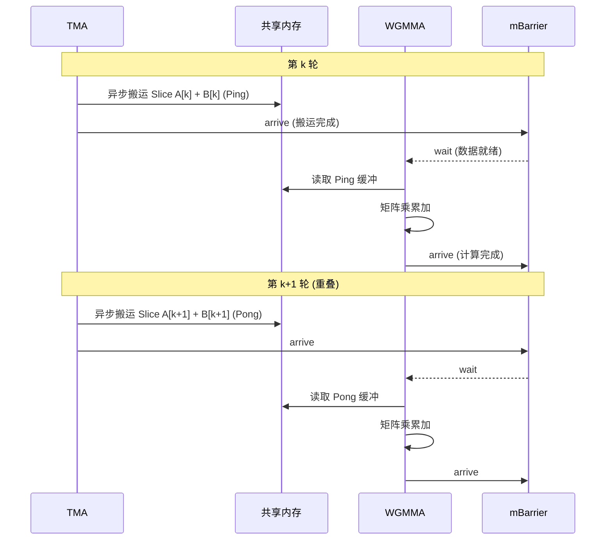
```mermaid
sequenceDiagram
    participant TMA as TMA
    participant SMEM as 共享内存
    participant WGMMA as WGMMA
    participant MB as mBarrier

    Note over TMA,MB: 第 k 轮
    TMA->>SMEM: 异步搬运 Slice A[k] + B[k] (Ping)
    TMA->>MB: arrive (搬运完成)
    MB-->>WGMMA: wait (数据就绪)
    WGMMA->>SMEM: 读取 Ping 缓冲
    WGMMA->>WGMMA: 矩阵乘累加
    WGMMA->>MB: arrive (计算完成)
    
    Note over TMA,MB: 第 k+1 轮 (重叠)
    TMA->>SMEM: 异步搬运 Slice A[k+1] + B[k+1] (Pong)
    TMA->>MB: arrive
    MB-->>WGMMA: wait
    WGMMA->>SMEM: 读取 Pong 缓冲
    WGMMA->>WGMMA: 矩阵乘累加
    WGMMA->>MB: arrive
```

### 9.2 时序重叠

K-Loop 的核心思想是 **计算与搬运完全重叠**：

- **第 k 轮计算** 的同时，**第 k+1 轮的数据搬运** 已经开始
- 通过双缓冲（Ping/Pong），计算单元永远不会等待数据
- mBarrier 确保每一轮的依赖关系正确

---

## 10. 总结与展望

### 10.1 架构亮点

| 特性 | 优势 |
|------|------|
| **宏数据流模型** | 天然支持异步并行，减少同步开销 |
| **四层硬件层级** | 清晰的资源隔离与局部化通信 |
| **信用驱动取指** | 精确的流水线背压控制，无缓冲区溢出 |
| **异构寄存器堆** | 消除端口瓶颈，降低面积功耗 |
| **Quarter-Rate vALU** | 面积效率提升 4 倍 |
| **TMA + mBarrier + WGMMA** | 全异步张量流，突破访存比极限 |
| **K-Loop 软流水线** | 计算与搬运完全重叠 |

### 10.2 适用场景

- **AI 推理与训练**：GEMM、Attention、卷积等张量运算
- **HPC 计算**：科学计算、数值模拟
- **通用并行计算**：图像处理、信号处理、数据并行

### 10.3 未来展望

- **扩展指令集**：增加更多 AI 专用指令，如 Attention、LayerNorm 等
- **多芯片互联**：支持多 GPU 芯片的 Cache Coherent 互联
- **高级调试支持**：硬件级性能计数器与调试接口
- **功耗优化**：细粒度时钟门控与动态电压频率调整

---

## 附录：术语表

| 缩写 | 全称 | 说明 |
|------|------|------|
| **ACE** | Asynchronous Compute Engine | 异步计算引擎，全局任务分发器 |
| **ACU** | Address Coalescing Unit | 地址合并单元，PRT 算法实现 |
| **aGPR** | Accumulator General Purpose Register | 累加器通用寄存器，WGMMA 专用 |
| **AGU** | Address Generation Unit | 地址生成单元 |
| **ARU** | Address Request Unit | 地址请求单元 |
| **BD** | Block Descriptor | 块描述符，32B 数据包 |
| **BRU** | Branch Unit | 分支单元 |
| **BS** | Block Scheduler | 块调度器 |
| **CAM** | Content Addressable Memory | 内容可寻址存储器 |
| **CU** | Collector Unit | 搜集器单元 |
| **DPP** | Data Parallel Primitives | 数据并行原语，跨通道交换 |
| **DRU** | Data Routing Unit | 数据路由单元 |
| **GDU** | Grid Dispatch Unit | 网格分发单元 |
| **GEMM** | General Matrix Multiply | 通用矩阵乘 |
| **GMMU** | Global Memory Management Unit | 全局内存管理单元 |
| **GPGPU** | General-Purpose Graphics Processing Unit | 通用图形处理器 |
| **IFU** | Instruction Fetch Unit | 取指单元 |
| **ISA** | Instruction Set Architecture | 指令集架构 |
| **KLP** | Kernel Launch Packet | 内核启动包，64B |
| **L0 I-Cache** | Level 0 Instruction Cache | 零级指令缓存 |
| **L0 K-Cache** | Level 0 Constant Cache | 零级常量缓存 |
| **L1 D-Cache** | Level 1 Data Cache | 一级数据缓存 |
| **LDC** | Load Constant | 常量加载指令 |
| **LDG** | Load Global | 全局内存加载指令 |
| **LDQ** | Load Data Queue | 读数据返回队列 |
| **LDS** | Load Shared | 共享内存加载指令 |
| **LSU** | Load/Store Unit | 加载/存储单元 |
| **mBarrier** | Hardware Barrier | 硬件屏障同步原语 |
| **MMA** | Matrix Multiply-Accumulate | 矩阵乘累加 |
| **MOU** | Memory Ordering Unit | 内存排序单元 |
| **MRQ** | Memory Request Queue | 内存请求队列 |
| **MSHR** | Miss Status Holding Register | 缺失状态保持寄存器 |
| **OC** | Operand Collector | 操作数搜集器 |
| **PC** | Program Counter | 程序计数器 |
| **PE** | Processing Element | 处理单元 |
| **pGPR** | Predicate General Purpose Register | 谓词通用寄存器 |
| **PRT** | Partition & Routing | 分区与路由，地址合并算法 |
| **PST** | PC State Table | PC 状态表 |
| **RBMU** | Register Bus Management Unit | 寄存器总线管理单元 |
| **RCB** | Result Commit Buffer | 结果提交缓冲区 |
| **RMU** | Resource Management Unit | 资源管理单元 |
| **ROC** | Read-Only Cache | 统一只读缓存 (L1I + L1K) |
| **RQI** | Request Queue Issue | 请求队列发射单元 |
| **SDQ** | Store Data Queue | 写数据队列 |
| **SFU** | Special Function Unit | 特殊函数单元 |
| **SIMT** | Single Instruction, Multiple Threads | 单指令多线程 |
| **SM** | Streaming Multiprocessor | 流多处理器 |
| **SMAC** | Shared Memory Access Controller | 共享内存访问控制器 |
| **SMSP** | SM Sub-Partition | SM 子分区（子核） |
| **TMA** | Tensor Memory Accelerator | 张量内存加速器 |
| **uGPR** | Scalar General Purpose Register | 标量通用寄存器 |
| **vALU** | Vector Arithmetic Logic Unit | 向量算术逻辑单元 |
| **vGPR** | Vector General Purpose Register | 向量通用寄存器 |
| **Warp** | - | 线程束，32 线程的执行单元 |
| **WGMMA** | Warp-Group Matrix Multiply-Accumulate | Warp-组矩阵乘累加 |
| **WS** | Warp Scheduler | 线程束调度器 |
| **WST** | Warp State Table | Warp 状态表 |

---

> **文档版本**：v1.0
> **最后更新**：2026 年 5 月