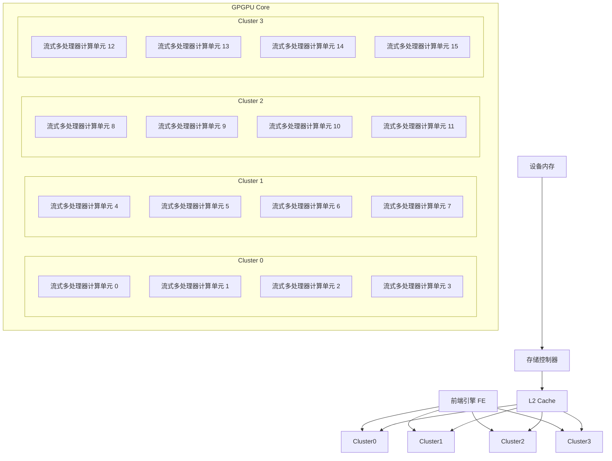
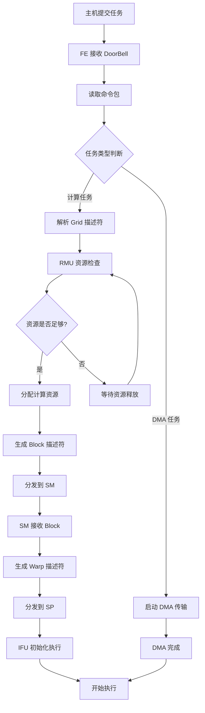
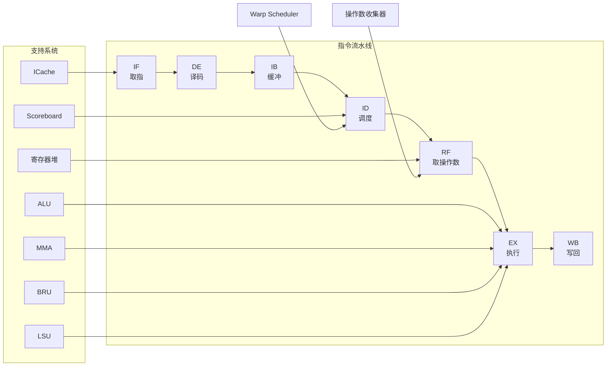
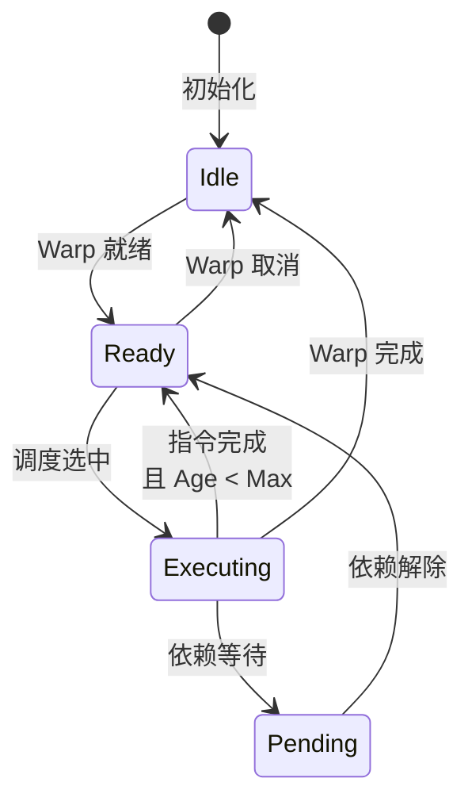
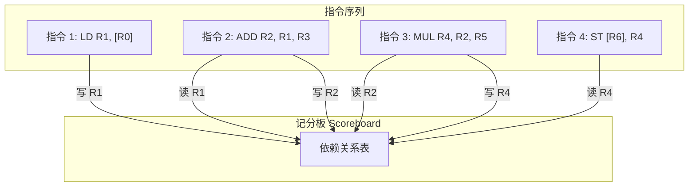
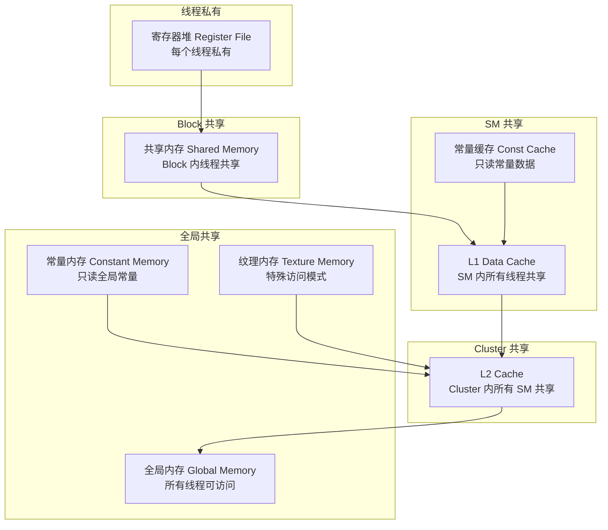
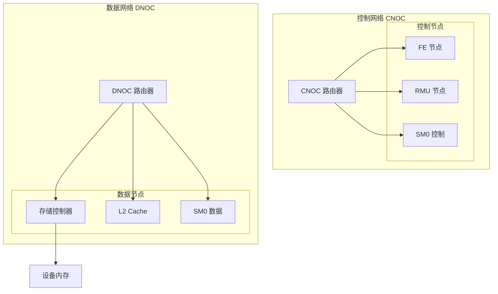
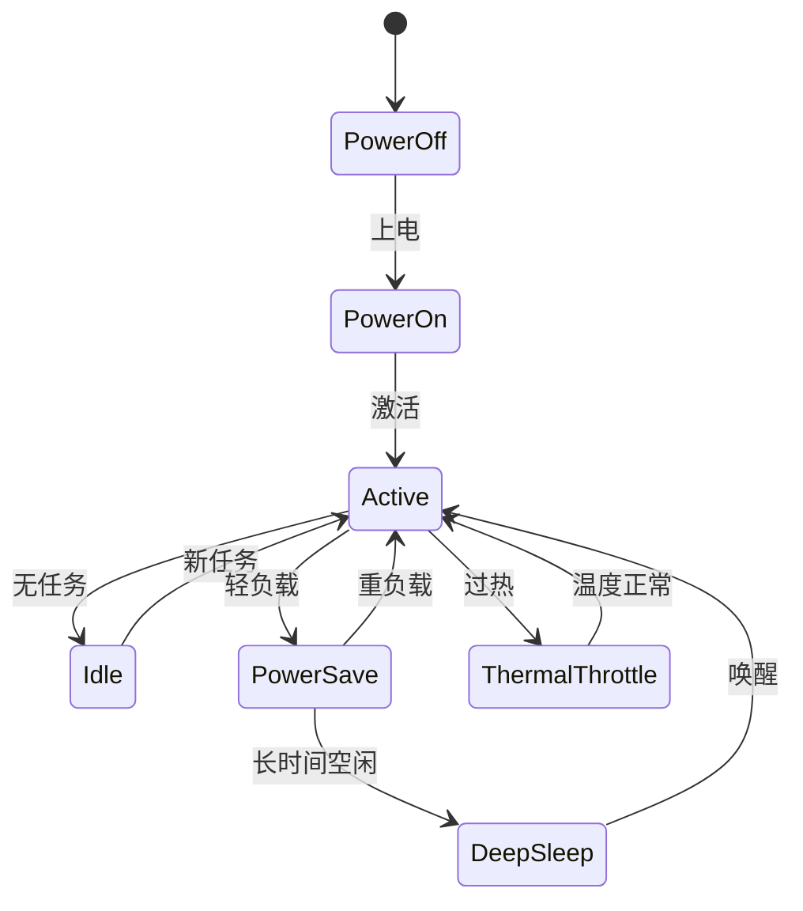
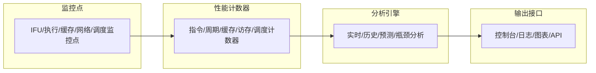

# OpenGPGPU Chisel Model架构综合文档

## 1. 概述

OpenGPGPU Chisel model (简称CModel) 是一个基于 Chisel 的 GPGPU 仿真框架，旨在准确模拟现代 GPGPU 的完整架构和工作原理。本文档综合了  OpenGPGPU 的总体设计思想、模块划分、数据流、工作机制以及各类可视化架构图，为 OpenGPGPU 架构研究、算法开发和性能优化提供全面、结构清晰的参考。

### 1.1 核心设计理念

1. **流式执行引擎**
   采用**流式执行模型**，核心思想是通过指令流与数据布局的深度匹配，利用大规模并行性将长延迟隐藏在连续不间断的指令流中。
2. **模块化与可扩展性**
   - **分层设计**：支持从 Block 级到系统级的逐步集成。
   - **可扩展架构**：计算单元、缓存系统、互连网络均可独立扩展。
   - **松耦合**：模块间通过标准接口通信（如 DecoupledIO 握手接口），降低系统复杂度。
3. **真实硬件映射**
   实现线程、Warp、Block 到物理计算资源（Lane、SP、SM）的精确映射，采用真实的存储层次结构与片上网络互连。

### 1.2 总体架构图



---

## 2. 编程模型与层次化映射

系统采用**四层物理架构**（系统层、集群层、单元层、处理器层），并与单指令多线程 (SIMT) 编程模型进行了严格的映射。

### 2.1 编程模型映射

```text
Grid (任务网格)
  ├── Block 0 (线程块)
  │     ├── Warp 0 (32个线程)
  │     ├── Warp 1
  │     └── ...
  ├── Block 1
  └── ...
```

- **单指令多线程 (SIMT)**: 一条指令同时处理多个数据元素。
- **Warp 为调度单元**: 32个线程组成一个 Warp。
- **硬件资源映射**:
  - **Thread**: 映射到流处理器 (SP) 的执行车道 (Lane)。
  - **Warp**: 映射到 SP 的调度单元。
  - **Block**: 映射到流式多处理器 (SM) 的执行上下文。
  - **Grid**: 映射到集群 (Cluster) 或整个 GPGPU Core。

---

## 3. 核心子系统架构详述

### 3.1 前端引擎 (FE) 与任务分发

前端引擎负责接收主机发来的命令包，解析任务，并进行资源的统一管理和分配。将巨大的 Grid 分解为 Block 和 Warp 后分发给底层的硬件执行单元。

#### 任务分发流程图



### 3.2 计算单元 (SM) 架构

流式多处理器 (SM) 是 GPGPU 核心的计算枢纽，每个 SM 内部包含多个流处理器 (SP) 及其共享资源。

- **4个流处理器 (SP)**：执行实际运算。
- **共享内存 (Shared Memory)**：供当前 Block 内所有线程共享的高速空间。
- **L1 缓存与常量缓存**：加速数据与只读常量的访存。

#### SM 内部架构图

```mermaid
graph TB
    subgraph "流式多处理器计算单元 SM"
        subgraph "流处理器 SP0"
            IFU0[IFU 取指单元]
            DEC0[Decoder 译码器]
            IB0[IBuffer 指令缓冲]
            WS0[Warp Scheduler]
            EX0[执行单元]
        end
        
        subgraph "流处理器 SP1"
            IFU1[IFU 取指单元]
            DEC1[Decoder 译码器]
            IB1[IBuffer 指令缓冲]
            WS1[Warp Scheduler]
            EX1[执行单元]
        end
        
        subgraph "流处理器 SP2"
            IFU2[IFU 取指单元]
            DEC2[Decoder 译码器]
            IB2[IBuffer 指令缓冲]
            WS2[Warp Scheduler]
            EX2[执行单元]
        end
        
        subgraph "流处理器 SP3"
            IFU3[IFU 取指单元]
            DEC3[Decoder 译码器]
            IB3[IBuffer 指令缓冲]
            WS3[Warp Scheduler]
            EX3[执行单元]
        end
        
        SM[共享内存 Shared Memory]
        L1[L1 Data Cache]
        CC[常量缓存 Const Cache]
    end
    
    CNOC[控制网络 CNOC] --> IFU0
    CNOC --> IFU1
    CNOC --> IFU2
    CNOC --> IFU3
    
    DNOC[数据网络 DNOC] --> L1
    DNOC --> CC
    DNOC --> SM
    
    L1 --> EX0
    L1 --> EX1
    L1 --> EX2
    L1 --> EX3
    
    CC --> EX0
    CC --> EX1
    CC --> EX2
    CC --> EX3
    
    SM --> EX0
    SM --> EX1
    SM --> EX2
    SM --> EX3
```



### 3.3 流处理器 (SP) 与执行流水线

SP 是执行 SIMT 指令的最小硬件单元，包含完整的深流水线执行结构。主要包括 IFU (取指)、Decoder (译码)、IBuffer (指令缓冲)、Warp Scheduler (Warp调度器)、Operand Reader (操作数读取) 以及各种执行单元（ALU、MMA、BRU、LSU）。

#### 流处理器指令流水线



---

## 4. 机制与算法设计

### 4.1 Warp 调度机制与状态机

Warp 调度负责最大化硬件利用率。为了隐藏延迟，SP 采用了多种调度机制：
- **Ready 队列** / **Pending 队列**：区分就绪与依赖等待的 Warp。
- **老化策略**：防止 Warp 饥饿。
- **记分板 (Scoreboard)**：跟踪指令之间的读写依赖。

#### Warp 调度状态转换图



#### Warp 调度与流控算法示例

```cpp
class WarpScheduler {
    std::queue<WarpID> ready_queue;
    std::queue<WarpID> pending_queue;
    Scoreboard scoreboard;
    std::map<WarpID, int> age_counters;
    
    WarpID schedule() {
        if (!ready_queue.empty()) {
            WarpID warp = ready_queue.front();
            if (age_counters[warp] < MAX_AGE) {
                age_counters[warp]++;
                return warp;
            } else {
                ready_queue.pop();
                ready_queue.push(warp);
                age_counters[warp] = 0;
                return schedule();
            }
        }
        return INVALID_WARP;
    }
};
```

#### 指令依赖关系（基于 Scoreboard）



### 4.2 存储访问合并 (Coalescing)

内存控制器可将相邻线程连续地址的独立访存请求进行合并，大幅提升存储器带宽利用率。

```cpp
class MemoryCoalescer {
    // 请求合并：将多线程连续地址的请求合并成较大的事务
    std::vector<MemoryRequest> coalesceRequests(const std::vector<MemoryRequest>& requests) {
        std::map<uint64_t, MemoryRequest> address_map;
        for (const auto& req : requests) {
            uint64_t aligned_addr = alignAddress(req.address);
            if (address_map.find(aligned_addr) == address_map.end()) {
                address_map[aligned_addr] = req;
            } else {
                auto& merged = address_map[aligned_addr];
                merged.threads.insert(merged.threads.end(), req.threads.begin(), req.threads.end());
                merged.size = std::max(merged.size, req.size);
            }
        }
        std::vector<MemoryRequest> coalesced;
        for (const auto& [addr, req] : address_map) coalesced.push_back(req);
        return coalesced;
    }
};
```

---

## 5. 存储系统与互连网络

### 5.1 存储层次结构

GPGPU 采用多级存储层次结构来缩减访存延迟并提高命中率。系统采用统一寻址机制。



### 5.2 互连网络拓扑

片上网络用于高速传输数据和控制信号：
- **CNOC (控制片上网络)**：承载控制通路，优化低延迟信号传输。
- **DNOC (数据片上网络)**：承载数据通路，提供大规模高带宽的并发传输。



---

## 6. 系统集成、电源管理与监控

CModel 不仅包含逻辑功能，还支持复杂的系统级抽象，如时钟域同步、功耗预估与热管理机制。

### 6.1 电源管理与热控状态机

利用 DVFS 技术与电源状态隔离，实现了精细的能耗控制。



### 6.2 性能监控架构

通过多点埋点搜集指令数、访存命中率、阻塞周期等关键指标，供分析引擎与外部工具链分析系统的性能瓶颈。



---

## 7. 验证、测试与开发路线图

### 7.1 分层验证方法

- **单元测试**: 验证单个模块（如 ALU 功能、译码正确性）。
- **集成测试**: 验证模块接口和数据通路（如基于 DecoupledIO 的读写交互）。
- **系统测试**: 运行完整的 Benchmark 或极限压力测试验证吞吐率及能效比。

### 7.2 开发路线图展望

- **阶段1: 基础架构 (当前)**：完成核心模块、建立基础测试与验证框架。
- **阶段2: 性能优化**：增强访存合并算法，深入优化调度器防止死锁与饥饿。
- **阶段3: 功能扩展与硬件演进**：支持下一代硬件抽象（如 Tensor Core，光追支持，3D 封装配置支持）。
- **阶段4: 应用生态**：完善上层开发工具链（Profiler、Debugger）。

## 8. 总结

CModel OpenGPGPU 架构在设计上高度注重**层次分明、逻辑严谨与功能模块化**。统一的综合文档呈现了从总体集群结构到细粒度的 SP 流水线，从指令与访存层面的控制机制到系统级的热能监控框架全貌。这不仅为开发者提供了深入理解 GPGPU 内部协同的抓手，也为日后架构创新与扩展留足了灵活空间。

---

*文档版本: 1.0 (综合版)*  
*最后更新: 2026-04-08*  
*核心参考路径: `/home/designer/public/OpenGPGPU/Arch_Model/`*
