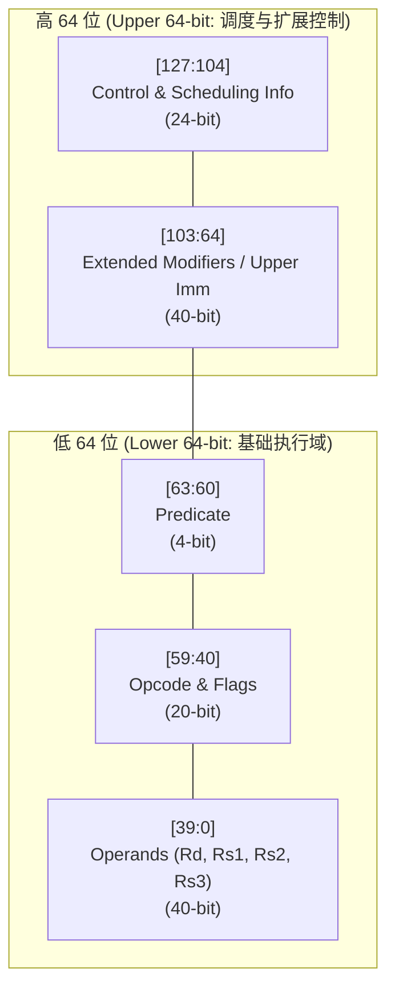

# OpenGPGPU MVP ISA 规范 (v2.0) — 128-bit 异步流架构指令集详解

## 第一章：指令集格式总览 (Instruction Format Overview)

### 1.1 128-bit 编码空间总览

OpenGPGPU MVP ISA 全面采用 **128-bit (16 Bytes) 定长编码**。每一条 128 位指令逻辑上划分为高 64 位（控制与元数据层）和低 64 位（执行与操作数层）：



#### 1.1.1 通用域字段详解

| 域名 | 起止位 | 长度 | 描述 |
|------|--------|------|------|
| Stall Count | [127:124] | 4-bit | 提示硬件需要延迟几个周期再发射下一条指令 |
| Read/Write Barrier | [123:112] | 12-bit | 多路读写依赖屏障编码（等待哪些依赖链） |
| Yield/Reuse Flags | [111:104] | 8-bit | 提示 Warp 切换权限及寄存器缓存重用控制 |
| Extended Modifiers / Upper Imm | [103:64] | 40-bit | 扩展空间，用于存放直接内存地址、立即数或张量数据类型标识 |
| Predicate (@PT) | [63:60] | 4-bit | 谓词寄存器掩码（如 `@P0`） |
| Opcode & Flags | [59:40] | 20-bit | 操作码 |
| Rd (Destination) | [39:32] | 8-bit | 目标寄存器索引 |
| Rs1 (Source 1) | [31:24] | 8-bit | 源操作数 1 寄存器索引 |
| Rs2 (Source 2) | [23:16] | 8-bit | 源操作数 2 寄存器索引 |
| Rs3 / Imm16 | [15:0] | 16-bit | 源操作数 3 或 16-bit 立即数 |

*注：寄存器文件类型由每条指令的 `Modifiers [51:40]` 字段中的 **操作数类型位 (Operand Type, OT)** 区分。为了完美路由 vGPR、uGPR、pGPR 以及立即数，OT 被扩宽为 **8-bit 位图掩码**（每操作数 2-bit：`[OT_Rd, OT_Rs1, OT_Rs2, OT_Rs3]`）：
- `0b00` = 去 vGPR Bank 抓取/写入 32 宽度的向量。
- `0b01` = 去 uGPR Bank 抓取/写入标量（并自动广播给 32 个通道，也是常量缓存 LDC 加载后的化身）。
- `0b10` = 去 pGPR Bank 抓取/写入谓词布尔掩码。
- `0b11` = 立即数 (Immediate)。硬件不查任何寄存器/缓存，译码器直接从指令的 [15:0] 或 Extended Modifiers 中截取数值。

#### 1.1.2 架构设计哲学

这种 128-bit 的设计将"执行 (Execution)"与"调度 (Scheduling)"融合在了一条指令中。译码器 (Decoder) 可以直接将高 64 位拆解送给 Scoreboard 和 Dispatcher，将低 64 位送给 Operand Collector (OC) 和执行单元。这种解耦 (Decoupling) 是实现极限性能的关键。

在传统的 CPU (如 RISC-V 32-bit) 或早期 GPU 中，指令编码极度拥挤。而在 NVIDIA Hopper (sm_90) 架构中，为了支持张量内存加速器 (TMA) 描述符、复杂的 MMA 路由以及彻底的软件流水线调度，大量指令被迫（或主动）升级为 128-bit 定长或变长编码。128-bit 指令彻底解放了操作码和操作数的拥挤，使得调度信息可以伴随每条指令显式下发。


### 1.2 硬件引导与 ABI 契约 (Hardware Bootstrapping ABI)

当 Warp 启动（PC = 0）前，Warp Allocator 必须通过硬件特权通道，将以下上下文强行打入寄存器堆，解决“第一推动力”的引导问题：

- `vGPR[R0]` (32-bit): 强制保留为 `Lane_ID` (0~31)。
- `uGPR[R0]` (32-bit): 强制保留为 `Block_ID` (CTA 坐标)。
- `uGPR[R1]` (32-bit): 强制保留为 `Block_Dim` (或 Grid Dimension)。
- `uGPR[R2:R3]` (64-bit): 强制保留为 Local Memory Stack Pointer (SP)，用于处理深层嵌套和寄存器溢出。
- `uGPR[R4:R5]` (64-bit): 🌟 强制保留为 Kernel Argument Root Pointer (参数区根指针)。指向 Constant Cache 中该内核专属的参数块基址。

*(注：一旦 Kernel 完成了早期的引导加载，如果确信后续不需要，编译器可以自由覆写这些 uGPR 来释放寄存器槽位。)*


---

## 第二章：异步访存搬运指令 (Async Memory Movement)

在 Hopper 架构中，计算不再是瓶颈，数据搬运才是。TMA (Tensor Memory Accelerator) 的本质是将全局内存 (Global Memory) 到共享内存 (Shared Memory) 的搬运过程完全硬件异步化，旁路掉传统的 L1 Cache 和 vALU。

### 2.1 TMA.LOAD (张量内存加速器异步加载)

#### 语义与数学表达

`Smem_Buffer[Desc] <= Async_DMA <= Global_Memory[Ptr]`。根据 `[95:64]` 中编码的描述符元数据，从全局内存拉取张量 Tile 到 Shared Memory。当搬运完成时，硬件自动向 `Rs3` 指向的 `MBARRIER` 内存对象发送 Arrive 事务扣减。

#### 物理编码映射

| 域名 | 起止位 | 长度 | 描述 |
|------|--------|------|------|
| Control & Scheduling | [127:104] | 24-bit | 调度控制域（Stall/Barrier/Yield） |
| Rs3 (MBarrier Handle) | [103:96] | 8-bit | 指向存放 MBARRIER 物理内存地址/句柄的寄存器 (通常为 uGPR) |
| Ext_Desc / Swizzle | [95:64] | 32-bit | TMA 描述符扩展，含多维张量在 Smem 中的布局映射（Swizzle 模式）等 |
| Predicate (@PT) | [63:60] | 4-bit | 谓词寄存器掩码 |
| Opcode | [59:52] | 8-bit | `0x1A` (TMA 类指令空间) |
| Modifiers | [51:40] | 12-bit | 张量维度信息 (1D/2D/3D)、数据类型 (FP16/INT8)、缓存剔除策略 |
| Rd (Smem Desc) | [39:32] | 8-bit | 指向 Shared Memory 中目标缓冲区的描述符寄存器（存放 Smem 基地址、Swizzle 模式等元数据） |
| Rs1 (Gmem Base Ptr / TMA Desc) | [31:24] | 8-bit | 存放 Global Memory 基地址的 64-bit 指针所在的连续寄存器对，或 TMA 描述符句柄 |
| Reserved | [23:0] | 24-bit | 保留 |

#### 硬件执行流 (RTL Behavior)

1. **Dispatch**: 指令发射，检测到 `TMA` 操作码，指令不进入 vALU，而是直接被路由到 TMA Engine 的命令队列 (Command Queue) 中。
2. **MBarrier Linkage**: 译码器从 Extended Modifiers [103:96] 提取 Rs3 寄存器索引，将其中的 MBarrier 内存句柄一同发送给 TMA 引擎。
3. **Execution**: TMA 引擎内部的 DMA 控制器接管总线，根据描述符计算多维地址，发起 AXI/PCIe 读请求，并将返回的数据直接写入 Shared Memory SRAM。
4. **Commit**: 当最后一个 Byte 写入 Smem 后，TMA 引擎向句柄指向的 MBarrier 内存地址发起特殊的原子扣减事务 (Arrive)。

#### sm_90 对标分析

在 NVIDIA `sm_90` 中，对应的指令是 `cp.async.bulk.tensor`。`TMA.LOAD` 完美复刻了其灵魂：Fire-and-Forget (发射即遗忘)。vALU 和寄存器堆 (vGPR) 的带宽被完全保护，没有一个比特的数据流经 ALU。

---

### 2.1b TMA.STORE (张量内存加速器异步存储)

#### 语义与数学表达

`Global_Memory[Ptr] <= Async_DMA <= Smem_Buffer[Desc]`。根据 TMA 描述符，将 Shared Memory 中的二维张量块通过异步 DMA 控制器直接推送到全局内存 (显存)。

#### 物理编码映射

| 域名 | 起止位 | 长度 | 描述 |
|------|--------|------|------|
| Control & Scheduling | [127:104] | 24-bit | 调度控制域 |
| Ext_Imm/Desc | [103:64] | 40-bit | TMA 存储描述符（包含目标全局内存的三维坐标和 Stride 步长） |
| Predicate (@PT) | [63:60] | 4-bit | 谓词寄存器掩码 |
| Opcode | [59:52] | 8-bit | `0x1B` (TMA 存储类) |
| Modifiers | [51:40] | 12-bit | 缓存规避策略（如 `.CS` 绕过 L2 缓存直接写 DDR/HBM 以防污染） |
| Rd (Smem Desc) | [39:32] | 8-bit | 指向存放待写回结果的 Shared Memory 缓冲区的描述符 |
| Rs1 (Gmem TMA Desc) | [31:24] | 8-bit | TMA 全局内存存储描述符所在的连续寄存器对 |
| Reserved | [23:0] | 24-bit | 保留 |

#### 硬件微架构行为 (RTL Behavior)

TMA 引擎从 Smem 拉取数据，根据描述符自动拆解成 PCIe/AXI 总线事务，发起 Burst Write（突发写）。此时 Warp 可以去执行其他逻辑，或者直接执行 `EXIT`（硬件底层的释放逻辑会等待 TMA 队列清空后再回收当前 Warp 的资源）。

---

### 2.2 STG (Store to Global Memory)

#### 语义与数学表达

`Global_Memory[Rs1 + Imm16] <= vGPR[Rs2]`。将计算完成的结果写回显存。

#### 物理编码映射

| 域名 | 起止位 | 长度 | 描述 |
|------|--------|------|------|
| Control & Scheduling | [127:104] | 24-bit | 调度控制域 |
| Extended Modifiers | [103:64] | 40-bit | 扩展修饰/立即数 |
| Predicate (@PT) | [63:60] | 4-bit | 谓词寄存器掩码 |
| Opcode | [59:52] | 8-bit | `0x0E` (内存存储类) |
| Modifiers | [51:40] | 12-bit | 宽度控制 (32/64/128-bit) 及 L2 缓存策略 (WB/WT/Bypass) |
| Rd | [39:32] | 8-bit | 不使用 |
| Rs1 (Base Address) | [31:24] | 8-bit | 基地址寄存器 |
| Rs2 (Data vGPR) | [23:16] | 8-bit | 要写回的数据所在的 vGPR 起始索引 |
| Imm16 | [15:0] | 16-bit | 16-bit 有符号地址偏移量 |

#### 硬件执行流 (RTL Behavior)

1. OC 从 vGPR 读取 `Rs1` 和 `Rs2` (此时可能引发严重 Bank 冲突，因为要读取海量数据，OC 会多周期收集)。
2. 数据送入 vALU，在 EX1 级和 EX2 级利用加法树计算出 32 个线程的最终有效地址 `Effective_Address[i] = Rs1[i] + Imm16`。
3. vALU 不写回 RCB，而是将 32 个地址和 32 个数据打包成 `Store_Request`，发往 LSU (Load/Store Unit) 的合并缓冲 (Coalescing Buffer)。
4. LSU 检测地址连续性，将 32 个 32-bit 散乱请求合并为 1 个 1024-bit 宽内存写请求。

#### sm_90 对标分析

对应 NVIDIA 的 `STG.E` (Store Global Extended)。在 MVP 中，得益于 128-bit 编码，`Imm16` 足够大，编译器能够轻易展开循环的地址偏移，不需要插入额外的地址计算指令。

---

### 2.3 LDG (Load from Global Memory to Register)

与将数据搬运到 Shared Memory 的 `TMA` 不同，`LDG` 的目标是直接将数据搬运到 vGPR (Vector General Purpose Registers) 中。在现代 GPU 中，这也是引发访存延迟和功耗最大的指令之一。因此，在我们的 128-bit 异步流架构中，`LDG` 被设计为一条高度异步化、带有合并 (Coalescing) 机制的硬核指令。

#### 语义与数学表达

`vGPR[Rd] <= Async_Load <= Global_Memory[Rs1 + Imm16]`

对于 Warp 中的每一个激活线程 `i`，计算有效地址 `EAi = Rs1i + Imm16`，向显存发起读请求，待数据返回后，将其写入每个线程对应的目标寄存器 `Rdi`。

#### 物理编码映射

| 域名 | 起止位 | 长度 | 描述 |
|------|--------|------|------|
| Stall Count | [127:124] | 4-bit | 延迟周期提示 |
| Read_Barrier_ID | [123:118] | 6-bit | 读屏障 ID，等待 Rs1 基地址依赖就绪 |
| Write_Barrier_ID | [117:112] | 6-bit | 写屏障 ID，数据写入 vGPR 后释放 |
| Yield/Reuse Flags | [111:104] | 8-bit | Warp 切换权限及寄存器重用控制 |
| Ext_Imm (扩展立即数) | [103:64] | 40-bit | 扩展偏移量或 64-bit 绝对物理基地址 |
| Predicate (@PT) | [63:60] | 4-bit | 谓词寄存器掩码 |
| Opcode | [59:52] | 8-bit | `0x0D` (内存加载类) |
| Modifiers | [51:40] | 12-bit | 数据宽度/类型 (`.U8/.S8/.U16/.F32/.64/.128`) 及缓存策略 (`.CG/.CS/.CV`) |
| Rd (Destination) | [39:32] | 8-bit | 目标 vGPR 起始索引 |
| Rs1 (Base Address) | [31:24] | 8-bit | 64-bit 基地址寄存器对首地址 |
| Reserved | [23:16] | 8-bit | 保留 |
| Imm16 | [15:0] | 16-bit | 16-bit 立即数偏移量 |

#### 硬件执行流与微架构行为 (RTL Behavior & Dataflow)

`LDG` 指令的执行不经过普通的 vALU 计算流水线，而是由一个专门的复杂外围部件——LSU (Load/Store Unit, 访存单元) 和 Memory Coalescer (内存合并器) 来接管。

**阶段一：指令译码与地址生成 (AGU Stage)**

1. OC 操作数收集：Operand Collector 从 vGPR 或 uGPR 读取 32 个线程的基地址 `Rs1`。
2. 有效地址计算 (Address Generation)：数据进入 LSU 内部专用的 AGU 阵列（通常是简单的 32 个并行整数加法器），执行 `EAi = Rs1i + Imm16`。
3. 掩码交集：结合 `@PT` 和 `Active_Mask`，将不活动的线程地址标记为无效（Invalid），不发向内存。

**阶段二：内存合并与请求发送 (Coalescing Stage — 架构核心)**

这是 GPU 访存的灵魂。32 个线程如果发起 32 个独立的内存请求，DRAM 的控制总线会立刻瘫痪。

1. 连续性检测：LSU 硬件检查 32 个线程的 `EAi` 是否落在同一个或连续的 Cache Line（通常为 128 Bytes）内。
2. 完美合并 (Perfect Coalescing)：如果代码是 `Addr = Base + ThreadID * 4`，这 32 个 32-bit (4 Bytes) 数据刚好完美拼成一个 128 Bytes 的连续块。LSU 会将 32 个请求合并为 1 个超宽的 L1/L2 Cache 读请求。
3. 发散处理 (Uncoalesced Memory Access)：如果地址是随机跳跃的（如 `A[Index[i]]`），LSU 会将其拆分为多个独立的 Cache Line 请求分批发送。这会导致访存性能暴跌至原来的 $1/32$。
4. Warp 挂起：合并请求发往 L1 Data Cache 后，LSU 记录下该请求对应的 `Warp ID`、`Rd` 目标寄存器和 `Write_Barrier_ID`。此时，该指令从前端彻底退役，Warp Scheduler 切换执行其他 Warp。

**阶段三：数据返回与写回 (Return & Commit Stage)**

经过漫长的等待（如果 L1 Miss，L2 Miss，直到访问 DDR/HBM），数据终于沿数据总线返回。

1. 对齐与解包 (Alignment & Unpacking)：LSU 接收到 128 Bytes 的 Cache Line 数据，根据之前记录的线程地址索引，将数据"切分"并对齐到 32 个线程的通道上。
2. 进入 RCB (Result Commit Buffer)：这是我们的创新架构优势。LSU 将重组好的 1024-bit (32 x 32-bit) 宽数据包打入 RCB，而不是直接去抢占 vGPR 写端口。
3. 静默写回与屏障释放：
   - RCB 的 Write Arbiter 寻找 vGPR Bank 的空闲周期，将数据平滑写入。
   - 物理写入完成的下一个时钟周期，RCB 通知 Scoreboard：释放 `Write_Barrier_ID`。
   - Scoreboard 中依赖此屏障的后续计算指令（如 `FADD`）被唤醒，进入就绪队列。

#### sm_90 架构对标与设计启示

在 NVIDIA 的实际硬件中，访存指令经历了数代演进：

1. 早期的 `LD` (sm_20~sm_50)：依赖硬件隐式的 Scoreboard 寄存器计分板。执行 `LDG R0, [R2]` 时，`R0` 会被硬件上锁。下一条使用 `R0` 的指令在取指阶段就会被卡住。
2. 异步化演进 (sm_70/sm_80)：引入了 `LDG.E.ASYNC` 等尝试，开始将指令与缓存控制显式暴露给编译器。
3. 我们的 MVP 128-bit `LDG`：完美对标甚至超越了目前的 SASS 逻辑。
   - **显式屏障 [WBar: X]**：我们摒弃了隐式寄存器锁。`LDG` 执行完毕的标志不是"寄存器状态变了"，而是"屏障倒数结束"。这使得编译器可以在 `LDG` 和 `FADD` 之间插入上百条互不干扰的计算指令，极大地拉长了流水线，完美隐藏了 DDR 的数百周期延迟（Latency Hiding）。
   - **配合 `.128` 修饰符（向量化加载）**：如果你在代码中写 `float4` 类型，MVP ISA 只需要发射一次 `LDG.128 [WBar: 0] R0, [R4]`。LSU 会一次性拉取 4 个连续的寄存器 `(R0, R1, R2, R3)`，相当于一个线程拉取 16 Bytes，一个 Warp 单周期吞吐 512 Bytes。这是现代 Kernel（如 PagedAttention）能跑满 HBM 几 TB/s 带宽的核心秘诀。

---


---

### 2.4 LDS (Load from Shared Memory)

与 Global Memory 的高延迟极度依赖异步 DMA (TMA) 不同，Shared Memory 位于 SM 内部，具备极低的访问延迟和细粒度的线程级交互能力。

#### 语义与数学表达

`vGPR[Rd] <= Smem[Rs1 + Imm16]`。每个激活的线程从 Shared Memory 中读取数据。通常 Rs1 使用标量寄存器（uGPR）提供 Warp 统一基址，结合 Imm16 偏移量计算物理地址。

#### 物理编码映射

| 域名 | 起止位 | 长度 | 描述 |
|------|--------|------|------|
| Control & Scheduling | [127:104] | 24-bit | 调度控制域 |
| Extended Modifiers | [103:64] | 40-bit | 扩展修饰/立即数 |
| Predicate (@PT) | [63:60] | 4-bit | 谓词寄存器掩码 |
| Opcode | [59:52] | 8-bit | 共享内存加载类 |
| Modifiers | [51:40] | 12-bit | 数据宽度控制及缓存策略 |
| Rd (Destination) | [39:32] | 8-bit | 目标 vGPR 索引 |
| Rs1 (Base Address) | [31:24] | 8-bit | 基地址寄存器 |
| Reserved | [23:16] | 8-bit | 保留 |
| Imm16 | [15:0] | 16-bit | 16-bit 地址偏移量 |

#### 硬件执行流 (RTL Behavior)

发送给 LSU 内部的 Smem 控制器。如果发生 Bank Conflict（如多个线程访问同一个 Bank 的不同地址），Smem 控制器会自动将请求串行化（Replay），这会导致延迟增加。数据返回时，通过 RCB 写入 vGPR，并释放指令中绑定的写屏障。

---

### 2.5 STS (Store to Shared Memory)

#### 语义与数学表达

`Smem[Rs1 + Imm16] <= vGPR[Rs2]`。将寄存器数据写入 Shared Memory，供 Warp 内或 Warp 间的线程交换数据。

#### 物理编码映射

| 域名 | 起止位 | 长度 | 描述 |
|------|--------|------|------|
| Control & Scheduling | [127:104] | 24-bit | 调度控制域 |
| Extended Modifiers | [103:64] | 40-bit | 扩展修饰/立即数 |
| Predicate (@PT) | [63:60] | 4-bit | 谓词寄存器掩码 |
| Opcode | [59:52] | 8-bit | 共享内存存储类 |
| Modifiers | [51:40] | 12-bit | 数据宽度控制 |
| Rd | [39:32] | 8-bit | 不使用 |
| Rs1 (Base Address) | [31:24] | 8-bit | 基地址寄存器 |
| Rs2 (Data vGPR) | [23:16] | 8-bit | 源数据 vGPR 索引 |
| Imm16 | [15:0] | 16-bit | 16-bit 地址偏移量 |

#### 硬件执行流

属于 Fire-and-Forget 指令。数据离开 vGPR 进入 LSU 的写缓冲后，当前 Warp 即可继续执行。

---

### 2.6 LDL (Load from Local Memory)

#### 语义与数学表达

`Dest_Reg <= Local_Mem[R_SP + Imm16]`。从当前 Warp 或线程的私有栈（Local Memory）中恢复寄存器数据，主要用于处理寄存器溢出（Register Spilling）。

#### 物理编码映射

| 域名 | 起止位 | 长度 | 描述 |
|------|--------|------|------|
| Control & Scheduling | [127:104] | 24-bit | 调度控制域 |
| Extended Modifiers | [103:64] | 40-bit | 扩展修饰/立即数 |
| Predicate (@PT) | [63:60] | 4-bit | 谓词寄存器掩码 |
| Opcode | [59:52] | 8-bit | 局部内存加载类 |
| Modifiers | [51:40] | 12-bit | 数据宽度控制 |
| Rd (Destination) | [39:32] | 8-bit | 目标寄存器索引 |
| Rs1 (R_SP) | [31:24] | 8-bit | 栈指针寄存器 |
| Reserved | [23:16] | 8-bit | 保留 |
| Imm16 | [15:0] | 16-bit | 16-bit 地址偏移量 |

#### 硬件执行流

LSU 接收到请求后，会利用硬件级地址翻译（Address Translation），自动将 Thread_ID 或 Warp_ID 的交织偏移量混入物理地址中，从而在 L1 Cache/Global Memory 中实现完美的合并内存访问。

---

### 2.7 STL (Store to Local Memory)

#### 语义与数学表达

`Local_Mem[R_SP + Imm16] <= Src_Reg`。将当前寄存器（如耗尽的变量或分支前保存的 EXEC 掩码）压入局部内存栈。

#### 物理编码映射

| 域名 | 起止位 | 长度 | 描述 |
|------|--------|------|------|
| Control & Scheduling | [127:104] | 24-bit | 调度控制域 |
| Extended Modifiers | [103:64] | 40-bit | 扩展修饰/立即数 |
| Predicate (@PT) | [63:60] | 4-bit | 谓词寄存器掩码 |
| Opcode | [59:52] | 8-bit | 局部内存存储类 |
| Modifiers | [51:40] | 12-bit | 数据宽度控制 |
| Rd | [39:32] | 8-bit | 不使用 |
| Rs1 (R_SP) | [31:24] | 8-bit | 栈指针寄存器 |
| Rs2 (Src_Reg) | [23:16] | 8-bit | 源数据寄存器索引 |
| Imm16 | [15:0] | 16-bit | 16-bit 地址偏移量 |

*(注：高位控制域与 LDL 保持一致)*


---

### 2.8 LDC (Load from Constant Memory)

内核参数通常由 Host (CPU) 准备，并在 Kernel 启动前推送到 SM 的 Constant Cache Bank。`LDC` 利用单播转广播 (Broadcast) 特性，极速将常量提取到标量寄存器。

#### 语义与数学表达

`uGPR[Rd] <= Constant_Cache[Rs1 + Imm16]`。所有线程共用同一个请求，Cache 命中后瞬间广播。

#### 物理编码映射

| 域名 | 起止位 | 长度 | 描述 |
|------|--------|------|------|
| Control & Scheduling | [127:104] | 24-bit | 调度控制域 |
| Extended Modifiers | [103:64] | 40-bit | 扩展修饰 / 立即数 |
| Predicate (@PT) | [63:60] | 4-bit | 谓词寄存器掩码 |
| Opcode | [59:52] | 8-bit | 常量内存加载类 |
| Modifiers | [51:40] | 12-bit | 数据宽度 (`.32` / `.64` / `.128`) |
| Rd (Destination) | [39:32] | 8-bit | 目标 uGPR 索引 |
| Rs1 (Base Address) | [31:24] | 8-bit | 基地址寄存器 (通常为引导分配的根指针 `R4_R5`) |
| Reserved | [23:16] | 8-bit | 保留 |
| Imm16 | [15:0] | 16-bit | 16-bit 偏移量 |

#### 硬件执行流

由于常量内存几乎不发生 Cache Miss，`LDC` 作为一条定序指令，不绑定异步 `[WBar]` 屏障。它在发射后经过固定短延迟（如 4~8 拍）直接写回 uGPR 广播网络。

## 第三章：硬件异步屏障指令 (Hardware Synchronization)

> **💡 架构师注 (Architect's Note)：双重屏障体系的物理本质**
>
> 在阅读本章前，请务必在脑海中建立起 OpenGPGPU 的**“双重屏障 (Dual-Barrier)”**架构模型：
>
> 1. **Scoreboard Barrier (计分板屏障 / 寄存器级 / 细粒度)**：
>    - **表现形式**：指令高 64 位控制域中的 `[WBar: X]` / `[RBar: X]`。
>    - **物理本质**：SM 前端 Scoreboard（计分板）中的纯硬件触发器阵列 (Flip-Flops)，极其轻量（如 64 个槽位）。
>    - **应用场景**：极速的指令级依赖。例如 `LDG` 与 `FADD` 之间的数据准备，用于传统的流水线延迟隐藏 (Latency Hiding)。
>
> 2. **Memory Barrier / MBARRIER (内存屏障 / 内存级 / 粗粒度)**：
>    - **表现形式**：本章将要介绍的 `MBARRIER` 系列指令，以及作为三操作数指令句柄 (`Rs3`) 传入的指针。
>    - **物理本质**：在 Shared Memory (SRAM) 中实际分配的 64-bit 物理内存对象，记录事务完成的“字节数”或“线程数”。
>    - **应用场景**：宏观的异步大块数据流控制。专门服务于 TMA 引擎的海量 DMA 搬运、WGMMA 张量核心，以及跨 Warp/Block 的生产者-消费者模型。
>
> 简而言之：**Scoreboard 解决“下一条指令能不能发射”，而 MBARRIER 解决“这一批 4096 Bytes 的张量数据有没有落盘”。** 两者一内一外、一小一大，构成了现代高吞吐 GPU 的终极同步基石。

传统 CPU 依靠指令流的顺序执行和 ROB (Reorder Buffer) 保证依赖。但在 OpenGPGPU 中，TMA 搬运数据可能需要 300 拍，而 vALU 加法只需要 4 拍。为了协同它们，我们引入 `mbarrier`（内存屏障对象）机制。

### 3.1 MBARRIER.INIT (屏障对象初始化)

#### 语义与数学表达

在 Shared Memory 的特殊控制区分配一个 64-bit 的计数器，初始值为 `Expected_Tx_Count`。

#### 物理编码映射

| 域名 | 起止位 | 长度 | 描述 |
|------|--------|------|------|
| Control & Scheduling | [127:104] | 24-bit | 调度控制域 |
| Ext_Imm/Desc (Expected Count) | [103:64] | 40-bit | 预期事务到达数 (Expected Arrival Count)，代表要等待的字节数或线程数 |
| Predicate (@PT) | [63:60] | 4-bit | 谓词寄存器掩码 |
| Opcode | [59:52] | 8-bit | `0x30` (屏障控制类) |
| Modifiers | [51:40] | 12-bit | 屏障类型修饰 |
| Rd (Barrier Handle) | [39:32] | 8-bit | 指向保存屏障句柄（内存地址）的寄存器 |
| Reserved | [31:0] | 32-bit | 保留 |

#### 硬件执行流

该指令被直接派发给 LSU 的特权单元。LSU 在 Smem 中锁定一块地址，写入事务总数。如果并发初始化太多导致屏障资源枯竭，流水线将在此 Stall。

#### sm_90 对标分析

对应 PTX 的 `mbarrier.init`。Hopper 创新性地引入了事务计数（以 Byte 为单位），而不是简单的到达次数。OpenGPGPU MVP 继承了这一点：屏障不仅知道"几条指令"完成了，更知道"多少字节的数据"已经切实落盘。

---

### 3.2 MBARRIER.ARRIVE (到达并宣告)

#### 语义与数学表达

`MBarrier_Memory[Rs1] -= Imm16_Tx_Count`。主动扣减屏障的计数值。

#### 物理编码映射

| 域名 | 起止位 | 长度 | 描述 |
|------|--------|------|------|
| Control & Scheduling | [127:104] | 24-bit | 调度控制域 |
| Extended Modifiers | [103:64] | 40-bit | 扩展修饰 |
| Predicate (@PT) | [63:60] | 4-bit | 谓词寄存器掩码 |
| Opcode | [59:52] | 8-bit | `0x31` |
| Modifiers | [51:40] | 12-bit | 修饰符 |
| Rd | [39:32] | 8-bit | 不使用 |
| Rs1 (Barrier Handle) | [31:24] | 8-bit | 屏障对象的句柄地址 |
| Reserved | [23:16] | 8-bit | 保留 |
| Imm16 (Tx_Count) | [15:0] | 16-bit | 本次到达所代表的事务量（减数） |

#### 硬件执行流

1. 生成一个 Fire-and-Forget 的特殊的 Store 请求，发送给 Smem 控制器。
2. Smem 控制器收到后，在其内部的 ALU 执行一个原子减法 (Atomic Sub)。
3. 注意：这条指令不阻塞当前 Warp，Warp 发送完 Arrive 后继续往下执行。

#### sm_90 对标分析

对标 `mbarrier.arrive`。通常用于软件流水线 (Software Pipelining) 中，Warp 中的一个 Producer 线程组完成了其共享内存的准备工作，主动宣告数据已就绪。

---

### 3.3 MBARRIER.WAIT (阻塞等待屏障清零)

#### 语义与数学表达

`while (MBarrier_Memory[Rs1].Count != 0) { Suspend(Warp_ID); }`

#### 物理编码映射

| 域名 | 起止位 | 长度 | 描述 |
|------|--------|------|------|
| Control & Scheduling | [127:104] | 24-bit | 调度控制域 |
| Extended Modifiers | [103:64] | 40-bit | 扩展修饰 |
| Predicate (@PT) | [63:60] | 4-bit | 谓词寄存器掩码 |
| Opcode | [59:52] | 8-bit | `0x32` |
| Modifiers | [51:40] | 12-bit | Timeout 设置，防止死锁 |
| Rd | [39:32] | 8-bit | 不使用 |
| Rs1 (Barrier Handle) | [31:24] | 8-bit | 屏障句柄 |
| Reserved | [23:0] | 24-bit | 保留 |

#### 硬件执行流

1. 指令被 Decode 后，立即进入 Scoreboard 的 `Wait_Queue`（等待队列）。
2. Scoreboard 向全局 Warp Scheduler 发送 `Yield` 信号："把我这 32 个线程挂起，去调度别的 Warp"。
3. Scoreboard 的总线监听器 (Snoop Logic) 持续监听 Smem。当对应的屏障计数归零 (Phase 翻转) 时，Scoreboard 唤醒该 Warp，指令提交，流水线恢复。

#### sm_90 对标分析

核心对标指令。在 `sm_90_instructions.txt` 的 Trace 中，你会看到大量的 `TMA` 与 `WGMMA` 之间夹杂着 `Wait`。这是隐藏数百周期内存延迟的终极武器。

---

## 第四章：张量核心与累加器交互指令 (Tensor & aGPR Compute)

MVP ISA 的皇冠明珠。由于矩阵乘法对寄存器带宽要求极其变态（单周期需数百字节），架构将张量数据全部剥离至专门的 aGPR (Accelerator GPR) 中，并从 Smem 直读。

### 4.1 V2A (Vector to Accumulator Transfer)

#### 语义与数学表达

`aGPR[Rd] <= vGPR[Rs1]`。将普通向量寄存器的数据灌入张量加速器。

#### 物理编码映射

| 域名 | 起止位 | 长度 | 描述 |
|------|--------|------|------|
| Control & Scheduling | [127:104] | 24-bit | 调度控制域 |
| Extended Modifiers | [103:64] | 40-bit | 扩展修饰 |
| Predicate (@PT) | [63:60] | 4-bit | 谓词寄存器掩码 |
| Opcode | [59:52] | 8-bit | `0x40` (异构数据流转) |
| Modifiers | [51:40] | 12-bit | Pack 模式（如 2×FP32→4×FP16 打包） |
| Rd (Dest aGPR) | [39:32] | 8-bit | 目标 aGPR 起始索引（通常代表 1024-bit 槽位） |
| Rs1 (Src vGPR) | [31:24] | 8-bit | 源 vGPR 索引 |
| Reserved | [23:0] | 24-bit | 保留 |

#### 硬件执行流

OC 从 vGPR Bank 读出 1024-bit 数据。这批数据不进入 vALU，而是通过一条专用超宽内部总线 (Tensor Bridge) 直接打入 MMA 引擎旁的 aGPR Bank 中。

#### sm_90 对标分析

AMD CDNA (MI100/MI200/MI300) 中有明确的 `v_accvgpr_write` 指令。NVIDIA 则是在逻辑上隐含了寄存器的分配。MVP 采用显式的 `V2A`，极大降低了寄存器重命名的硬件复杂度。

---

### 4.2 A2V (Accumulator to Vector Transfer)

#### 语义与数学表达

`vGPR[Rd] <= aGPR[Rs1]`。计算完毕，提取张量结果。

#### 物理编码映射

| 域名 | 起止位 | 长度 | 描述 |
|------|--------|------|------|
| Control & Scheduling | [127:104] | 24-bit | 调度控制域 |
| Extended Modifiers | [103:64] | 40-bit | 扩展修饰 |
| Predicate (@PT) | [63:60] | 4-bit | 谓词寄存器掩码 |
| Opcode | [59:52] | 8-bit | `0x41` |
| Modifiers | [51:40] | 12-bit | Unpack 模式 / 激活函数（如硬件内嵌 ReLU） |
| Rd (Dest vGPR) | [39:32] | 8-bit | 目标 vGPR 索引 |
| Rs1 (Src aGPR) | [31:24] | 8-bit | 源 aGPR 索引 |
| Reserved | [23:0] | 24-bit | 保留 |

#### 硬件执行流

请求发送给 MMA 引擎。MMA 引擎择机从 aGPR 读出数据，将其丢入我们架构中设计的 RCB (Result Commit Buffer)。RCB 随后负责在没有 Bank 冲突时，将数据静默写入 vGPR。

---

### 4.3 WGMMA.M16N16K16 (张量矩阵核心乘加)

#### 语义与数学表达

`D = A × B + C`。执行 $16 \times 16$ 矩阵乘 $16 \times 16$ 矩阵的张量运算。

#### 物理编码映射

| 域名 | 起止位 | 长度 | 描述 |
|------|--------|------|------|
| Control & Scheduling | [127:104] | 24-bit | 调度控制域（含 Stall/RBar/WBar/Yield） |
| Extended Modifiers | [103:64] | 40-bit | 扩展修饰/描述符扩展 |
| Predicate (@PT) | [63:60] | 4-bit | 谓词寄存器掩码 |
| Opcode | [59:52] | 8-bit | `0x50` (WGMMA 类) |
| Modifiers | [51:40] | 12-bit | 乘加类型 (F16xF16→F32/BF16/INT8) 及 B 转置标志 (B_Trans) |
| Rd (Dest aGPR) | [39:32] | 8-bit | 目标 aGPR 索引（代表矩阵 C，同时也作为 D 覆写） |
| Rs1 (Smem Desc A) | [31:24] | 8-bit | 指向矩阵 A 在 Smem 中的 64-bit 描述符的 uGPR/vGPR |
| Rs2 (Smem Desc B) | [23:16] | 8-bit | 指向矩阵 B 在 Smem 中的 64-bit 描述符 |
| Reserved | [15:0] | 16-bit | 保留 |

#### 硬件执行流 (RTL Behavior)

1. **Issue**: 指令下发给 MMA 引擎的深层流水线。
2. **Descriptor Decode**: 硬件解析 Rs1 和 Rs2 中的矩阵描述符，获取矩阵在 Smem 中的 Base Address, Stride, 和 Swizzle (防冲突交织) 格式。
3. **Smem Direct Read**: MMA 引擎内部的矩阵抓取器 (Matrix Fetcher) 绕开 Operand Collector，利用专门的 1024-bit 超宽总线，在单周期内从 Shared Memory 并行读出 A 矩阵的 256 bytes 和 B 矩阵的 256 bytes。
4. **MAC Array**: 数据进入庞大的 3D 乘加器树 (Multiplier-Accumulator Tree)。例如，使用 Radix-4 乘法器完成并行点积。
5. **Accumulation**: 乘加结果在同一个周期内与 aGPR 对应的寄存器值相加，并写回 aGPR。

#### sm_90 对标分析

这正是 Hopper 架构中革命性的 `wgmma.mma_async` 指令。过去 (Ampere sm_80) 需要 `LDS` 将数据先从 Smem 读到 vGPR，再用 `HMMA` 计算。现在的 `WGMMA` 直接 `Smem -> MAC -> aGPR`。这彻底消除了 `vGPR` 的功耗和带宽瓶颈，是OpenGPGPU MVP ISA 能够处理大模型的根本保障。

---


---

### 4.4 A2S (Accumulator to Shared Memory)

#### 语义与数学表达

`Smem_Buffer[Rs1_Desc] <= Epilogue(aGPR[Rs2])`。

利用张量描述符的路由规则，将张量加速器 (aGPR) 中的累加结果排入 Shared Memory。在此过程中，硬件的 Epilogue 单元可对数据进行实时格式转换（如 FP32 转 FP16）和激活函数运算（如 ReLU）。

#### 物理编码映射

| 域名 | 起止位 | 长度 | 描述 |
|------|--------|------|------|
| Control & Scheduling | [127:104] | 24-bit | 调度控制域 |
| Rs3 (MBarrier Handle) | [103:96] | 8-bit | 指向存放 MBARRIER 物理内存地址/句柄的寄存器，用于完工通知 |
| Ext_Desc / Swizzle | [95:64] | 32-bit | 描述符扩展域（可编码交织模式等内联元数据） |
| Predicate (@PT) | [63:60] | 4-bit | 谓词寄存器掩码 |
| Opcode | [59:52] | 8-bit | `0x42` (异构数据流转 - 回写类) |
| Modifiers | [51:40] | 12-bit | 核心修饰符：精度降级压缩 (`.F32TO16` 等) 以及激活函数 (`.RELU`) |
| Rd | [39:32] | 8-bit | 不使用 |
| Rs1 (Smem Desc) | [31:24] | 8-bit | 指向 Shared Memory 目标缓冲区描述符的寄存器 (通常为 uGPR) |
| Rs2 (Src aGPR) | [23:16] | 8-bit | 源 aGPR 块的起始索引 |
| Reserved | [15:0] | 16-bit | 保留（原 Imm16 废弃，因为基地址已包含在描述符中） |

#### 硬件微架构行为 (RTL Behavior)

1. **解析与旁路**：MMA 引擎接收指令后，解析 Rs1 描述符中的基址与 Swizzle 模式，同时从 aGPR 读出超宽数据块。
2. **Epilogue 计算**：数据流经 MMA 尾部逻辑，执行截断或激活。
3. **交织写入 (Swizzled Store)**：处理后的结果根据描述符的交织规则，映射为无冲突的 Bank 地址，打入 LSU。完成后向 Rs3 句柄发送 MBarrier Arrive 信号。

## 第五章：控制流与谓词指令 (Control Flow & Predication)

没有 `if-else` 就不叫通用计算。MVP ISA 通过专用的谓词寄存器堆 (pGPR) 实现极其紧凑的控制流。

### 5.1 ISETP (Integer Set Predicate)

#### 语义与数学表达

`pGPR[Rd] = (Rs1 <Op> Rs2) ? True : False`。逐线程比较，生成 32-bit 布尔掩码。

#### 物理编码映射

| 域名 | 起止位 | 长度 | 描述 |
|------|--------|------|------|
| Control & Scheduling | [127:104] | 24-bit | 调度控制域 |
| Extended Modifiers | [103:64] | 40-bit | 扩展修饰 |
| Predicate (@PT) | [63:60] | 4-bit | 谓词寄存器掩码（与比较结果进行二次布尔运算） |
| Opcode | [59:52] | 8-bit | `0x20` (逻辑比较类) |
| Modifiers | [51:40] | 12-bit | 比较操作 (`.EQ/.NE/.LT/.GT/.LE/.GE`)、布尔规约 (`.AND/.OR/.XOR`)、数据类型 (`.U32/.S32`) |
| Rd (Dest pGPR) | [39:32] | 8-bit | 目标 pGPR (P0~P7)，低 3 位有效，高 5 位保留 |
| Rs1 | [31:24] | 8-bit | 待比较的 vGPR 数据 1 |
| Rs2 | [23:16] | 8-bit | 待比较的 vGPR 数据 2 |
| Reserved | [15:0] | 16-bit | 保留 |

#### 硬件执行流

由前文设计的 vALU 8-PE 阵列执行。在 EX2 级经过并行减法器得出符号位和零标志，在 EX4 级拼装出 32-bit 的 0/1 掩码。结果通过 RCB 直接写入专用的 pGPR 触发器阵列。

#### sm_90 对标分析

在 `sm_86_instructions` 和 `sm_90_instructions` 中都有 `ISETP` 和 `HSETP2`。引入布尔规约修饰符（如 `.AND`）是极其高阶的设计，它可以将复合条件 `if (a > 0 && b < 10)` 在一条指令内算出，极大节省了指令槽。

---

### 5.2 BRA (Branch Conditional)

#### 语义与数学表达

`if (@PT) PC = PC + Imm16; else PC = PC + 1;` 纯粹的标量宏观跳转指令。

#### 物理编码映射

| 域名 | 起止位 | 长度 | 描述 |
|------|--------|------|------|
| Control & Scheduling | [127:104] | 24-bit | 调度控制域 |
| Ext_Imm (Target Offset) | [103:64] | 40-bit | (可选) 绝对跳转地址 |
| Predicate (@PT) | [63:60] | 4-bit | 跳转判决谓词 |
| Opcode | [59:52] | 8-bit | `0x01` (控制流) |
| Modifiers | [51:40] | 12-bit | `.U` (Unanimous 标志，全 Warp 一致跳转) |
| Reserved | [39:16] | 24-bit | 保留 |
| Imm16 (Relative Offset) | [15:0] | 16-bit | 16-bit 有符号相对偏移量 |

#### 硬件执行流 (Software-Managed SIMT Divergence)

核心认知：发散分支的**“本质是掩蔽（Masking），而非跳转（Jumping）”**。

在 MVP ISA 中，**硬件收敛栈 (Reconvergence Stack) 被彻底废除**。由于只有 1 个硬件 PC，IFU 绝对无法在同一个时钟周期内分叉。

面对“一半线程想跳转，一半线程想顺延”的发散控制流，我们的解决路线如下：
1. **禁绝发散跳转**：普通的 `BRA` 指令**不允许**带有线程级发散的 `@PT`。
2. **uGPR 软件压栈**：在 `if` 块开始前，使用 `MOV uGPR[x], SR_EXEC` 将当前的执行掩码保存到分配的“软件栈”中。
3. **谓词覆写**：使用 `LOP32` 用 `P0` 覆写 `SR_EXEC`。此时，不满足条件的线程被硬件底层“静音”（时钟门控关闭）。
4. **顺序贯穿 (Fall-through)**：IFU 根本不跳转，它只是顺序读取 `PC+1`, `PC+2`...。静音的线程陪着活跃的线程一起“走”过这些指令，只是不写回结果。
5. **WBRA 兜底**：只有当 `SR_EXEC` 全为 0 时，才用 `WBRA.EZ` 跨过整个代码块。
6. **出栈恢复**：`if` 块结束，执行 `MOV SR_EXEC, uGPR[x]`，恢复发散前的掩码。

这种设计使 IFU 变成了一个极其简单的无脑累加器，把晶体管全省给了张量计算！

### 5.3 WBRA (Warp-Level Conditional Branch)

为了配合纯软件控制 SR_EXEC 掩码的架构哲学，我们引入了针对全 Warp 生命周期的“跳过”判决指令，避免无效指令流水线空转。

#### 语义与数学表达

`if (SR_EXEC == 0) PC = PC + Imm16;` 标量级别的宏观跳转，不区分具体线程，直接裁决当前整个 Warp 是否还有活跃工作需要处理。

#### 物理编码映射

| 域名 | 起止位 | 长度 | 描述 |
|------|--------|------|------|
| Control & Scheduling | [127:104] | 24-bit | 调度控制域 |
| Extended Modifiers | [103:64] | 40-bit | 扩展修饰 |
| Predicate (@PT) | [63:60] | 4-bit | 谓词寄存器掩码 |
| Opcode | [59:52] | 8-bit | 控制流类 |
| Modifiers | [51:40] | 12-bit | 跳转条件（如 .EZ/.ENZ） |
| Reserved | [39:16] | 24-bit | 保留 |
| Imm16 | [15:0] | 16-bit | 16-bit 有符号相对偏移量 |

#### 硬件微架构行为 (Microarchitecture Behavior)

1. **取指阶段截断**：取指单元 (IFU) 解码到 `WBRA` 时，直接查询硬件 `SR_EXEC` 寄存器的当前状态。
2. **极速跃迁**：如果条件满足（如 `.EZ` 且 `SR_EXEC` 全为 0），IFU 直接将 PC 加上相对偏移量更新。指令在此处终结，绝对不会被送入 vALU 或 LSU，彻底节省了数据通路功耗。
3. **大循环底座**：`WBRA.ENZ` 可配合 `while(1)` 的编译器结构，作为循环结束的极其高效的判决条件。

## 第六章：地址计算与标量数学指令 (Address & Scalar Math)

尽管 `WGMMA` 承担了 99% 的 FLOPS 计算量，但支撑起整个核函数循环逻辑、地址递增、基址偏移的，是坚若磐石的标量和基础数学指令。这就是 4 拍 8-PE vALU 主战场。

### 6.1 IMAD (Integer Multiply-Add)

#### 语义与数学表达

`Rd = (Rs1 × Rs2) + Rs3`。整数乘加，计算内存偏移量的基础指令。

#### 物理编码映射

| 域名 | 起止位 | 长度 | 描述 |
|------|--------|------|------|
| Control & Scheduling | [127:104] | 24-bit | 调度控制域 |
| Extended Modifiers / Upper Imm | [103:64] | 40-bit | 扩展立即数空间：当 Rs3/Imm16 不足以容纳立即数时（如 `IMAD Rd, Rs1, Imm, Rs3`），乘数立即数存放在此域的低位；否则为全零 |
| Predicate (@PT) | [63:60] | 4-bit | 谓词寄存器掩码 |
| Opcode | [59:52] | 8-bit | `0x24` |
| Modifiers | [51:40] | 12-bit | 符号控制 (`.U32/.S32`)、乘积选择 (`.HI/.WIDE`)、进位 (`.X`)、立即数标志 (`.IMM`：指示 Rs2 字段被用作立即数来源，实际立即数从 Extended Modifiers 低位提取) |
| Rd (Destination) | [39:32] | 8-bit | 目标寄存器 |
| Rs1 | [31:24] | 8-bit | 源操作数 1 |
| Rs2 / Imm_Sel | [23:16] | 8-bit | 源操作数 2 寄存器索引；当 `.IMM` 标志置位时，此字段的低位编码选择 Extended Modifiers 中的立即数宽度（8/16/32-bit） |
| Rs3 / Imm16 | [15:0] | 16-bit | 源操作数 3 寄存器索引，或 16-bit 立即数（当 `.IMM` 未置位且 Rs3 字段直接编码立即数时） |

#### 硬件执行流

在 vALU 的 EX2 和 EX3 级中，流经 32-bit 的华莱士树乘法器和 Kogge-Stone 加法器。这需要 Operand Collector 单次搜集 3 个源操作数。

#### sm_90 对标分析

在 *General-Purpose Graphics Processor Architecture* 参考书中提到，地址计算占 GPU 动态指令的高达 20~30%。`IMAD` 是 SASS 中出现频率仅次于 `MOV` 和 `LDG` 的指令。特别是对于 N 维张量切片，$Offset = X \times Stretch\_X + Y$，一条 `IMAD` 搞定。

---

### 6.2 IADD32 (Integer Add)

#### 语义与数学表达

`Rd = Rs1 + Rs2`。

#### 物理编码映射

| 域名 | 起止位 | 长度 | 描述 |
|------|--------|------|------|
| Control & Scheduling | [127:104] | 24-bit | 调度控制域 |
| Extended Modifiers | [103:64] | 40-bit | 扩展修饰/立即数 |
| Predicate (@PT) | [63:60] | 4-bit | 谓词寄存器掩码 |
| Opcode | [59:52] | 8-bit | `0x21` |
| Modifiers | [51:40] | 12-bit | `.SAT` (饱和到 MAX_INT) |
| Rd (Destination) | [39:32] | 8-bit | 目标寄存器 |
| Rs1 | [31:24] | 8-bit | 源操作数 1 |
| Imm24_High8 | [23:16] | 8-bit | 24-bit 立即数的高 8 位（当 Rs2 字段被用作立即数时） |
| Imm24_Low16 | [15:0] | 16-bit | 24-bit 立即数的低 16 位（与 [23:16] 拼接为完整 Imm24） |

#### 硬件执行流

vALU 的 EX2 级旁路掉乘法器，直接进入 EX3 级的快速加法树。配合 128-bit 调度域，可以实现在单拍内完成 1 个寄存器与 1 个立即数的快速递增（如 `i++`）。

---

### 6.3 FMA.F32 (Floating-Point Fused Multiply-Add)

#### 语义与数学表达

`Rd = (Rs1 × Rs2) + Rs3`。单精度浮点乘加。

#### 物理编码映射

| 域名 | 起止位 | 长度 | 描述 |
|------|--------|------|------|
| Control & Scheduling | [127:104] | 24-bit | 调度控制域 |
| Extended Modifiers | [103:64] | 40-bit | 扩展修饰/立即数 |
| Predicate (@PT) | [63:60] | 4-bit | 谓词寄存器掩码 |
| Opcode | [59:52] | 8-bit | `0x60` |
| Modifiers | [51:40] | 12-bit | 舍入模式 (`.RN/.RZ/.RM/.RP`)、`.FTZ` (刷新到零)、`.RELU` (硬件 ReLU) |
| Rd (Destination) | [39:32] | 8-bit | 目标寄存器 |
| Rs1 | [31:24] | 8-bit | 源操作数 1 |
| Rs2 | [23:16] | 8-bit | 源操作数 2 |
| Rs3 / Imm16 | [15:0] | 16-bit | 源操作数 3 或 16-bit 立即数 |

#### 硬件执行流

完全穿过 vALU 的四级深度流水线 (EX1 拆分与修饰 -> EX2 指针对齐与乘法树 -> EX3 LZA 预测与尾数求和 -> EX4 规格化与舍入)。

#### sm_90 对标分析

对标 `FFMA` (在 `sm_80_instructions.txt` 中可见)。虽然深度学习使用 FP16，但大量归一化算子 (LayerNorm, Softmax) 的方差/均值计算必须依靠 FP32 精度的 `FMA` 来防止溢出和精度丢失。MVP ISA 提供了完整的 FP32 标准支持。

---

### 6.4 FADD.F32 (Floating-Point Add)

#### 语义与数学表达

`Rd = Rs1 + Rs2`。

#### 物理编码映射

| 域名 | 起止位 | 长度 | 描述 |
|------|--------|------|------|
| Control & Scheduling | [127:104] | 24-bit | 调度控制域 |
| Extended Modifiers | [103:64] | 40-bit | 扩展修饰/立即数 |
| Predicate (@PT) | [63:60] | 4-bit | 谓词寄存器掩码 |
| Opcode | [59:52] | 8-bit | `0x61` |
| Modifiers | [51:40] | 12-bit | 舍入模式 (`.RN/.RZ/.RM/.RP`)、`.FTZ` (刷新到零) |
| Rd (Destination) | [39:32] | 8-bit | 目标寄存器 |
| Rs1 | [31:24] | 8-bit | 源操作数 1 |
| Rs2 | [23:16] | 8-bit | 源操作数 2 |
| Reserved | [15:0] | 16-bit | 保留（硬件内部将乘数 B 强制置为 1.0） |

---


---

### 6.5 MOV (Move / Special Register Read)

这是支撑 GPGPU 内部控制流运转、状态机判断和多维地址映射的轻量级 ALU 骨干指令。

#### 语义与数学表达

`Rd <= Rs1` 或 `Rd <= SR[Index]`。实现通用寄存器间的数据拷贝，或从硬件架构寄存器（如执行掩码）提取/覆写上下文。

#### 物理编码映射

| 域名 | 起止位 | 长度 | 描述 |
|------|--------|------|------|
| Control & Scheduling | [127:104] | 24-bit | 调度控制域 |
| Extended Modifiers | [103:64] | 40-bit | 扩展修饰 |
| Predicate (@PT) | [63:60] | 4-bit | 谓词寄存器掩码 |
| Opcode | [59:52] | 8-bit | 数据流转类 |
| Modifiers | [51:40] | 12-bit | `.SR` 修饰符等 |
| Rd (Destination) | [39:32] | 8-bit | 目标寄存器索引 |
| Rs1 (Source) | [31:24] | 8-bit | 源数据寄存器索引或 SR 索引 |
| Reserved | [23:0] | 24-bit | 保留 |

#### 硬件执行流

当检测到 `.SR` 修饰符时，Operand Collector 直接向 Warp Scheduler 或特定控制平面的只读/读写寄存器发起请求，旁路常规的 vGPR Bank 路由。

---

### 6.6 LOP32 (Logic Operation)

#### 语义与数学表达

`Rd = Rs1 <OP> Rs2`。执行逐位逻辑运算，常用于计算复杂地址掩码或覆写 `SR_EXEC` 控制流掩码。

#### 物理编码映射

| 域名 | 起止位 | 长度 | 描述 |
|------|--------|------|------|
| Control & Scheduling | [127:104] | 24-bit | 调度控制域 |
| Extended Modifiers | [103:64] | 40-bit | 扩展修饰 |
| Predicate (@PT) | [63:60] | 4-bit | 谓词寄存器掩码 |
| Opcode | [59:52] | 8-bit | 逻辑运算类 |
| Modifiers | [51:40] | 12-bit | 逻辑操作类型（如 AND/OR/XOR） |
| Rd (Destination) | [39:32] | 8-bit | 目标寄存器索引 |
| Rs1 | [31:24] | 8-bit | 源操作数 1 |
| Rs2 | [23:16] | 8-bit | 源操作数 2 |
| Reserved | [15:0] | 16-bit | 保留 |

*(注：高位控制域与常规数学指令保持一致)*

---

### 6.7 SHF (Shift)

#### 语义与数学表达

`Rd = Rs1 << Rs2` 或 `Rd = Rs1 >> Rs2`。执行算术或逻辑位移，是进行 2 的幂次乘除法（如对齐内存地址）的极速通路。

#### 物理编码映射

| 域名 | 起止位 | 长度 | 描述 |
|------|--------|------|------|
| Control & Scheduling | [127:104] | 24-bit | 调度控制域 |
| Extended Modifiers | [103:64] | 40-bit | 扩展修饰 |
| Predicate (@PT) | [63:60] | 4-bit | 谓词寄存器掩码 |
| Opcode | [59:52] | 8-bit | 移位计算类 |
| Modifiers | [51:40] | 12-bit | 位移类型（左移/右移/算术/逻辑） |
| Rd (Destination) | [39:32] | 8-bit | 目标寄存器索引 |
| Rs1 | [31:24] | 8-bit | 源操作数（被移位数） |
| Rs2 | [23:16] | 8-bit | 源操作数（移位量） |
| Reserved | [15:0] | 16-bit | 保留 |

#### 硬件执行流

在 vALU 流水线中，经过极简的桶形移位器 (Barrel Shifter)，通常旁路掉浮点和加法树，延迟极低。

## 第七章：指令示例 (Instruction Examples)

### 7.1 SASS 级机器码推演示例 (Machine Code Walkthrough)

为了直观感受 128-bit MVP ISA 的紧凑与强大，我们推演一条真实核函数中的 `WGMMA` 指令的物理二进制编码。

**场景：** 我们正在进行一次张量矩阵乘法：计算一个 $16 \times 16 \times 16$ 块。矩阵 A 和 B 的描述符存在 uGPR `R10` 和 `R12` 中，目标在 aGPR `A0` 中。编译器发现这条指令之前有一条内存加载，需要等待屏障 `Bar_1`；同时，算完之后需要耗时 6 拍，因此 `Stall_Count` 为 6。我们希望在遇到屏障未释放时主动出让算力 (`Yield = 1`)。没有任何谓词遮蔽 (`@PT` = True)。

**汇编形式：**

```asm
[Stall: 6, RBar: 1, Yield: 1] @PT WGMMA.F16.F16 A0, R10, R12
```

**128-bit 物理机器码分布 (从高到低)：**

- **调度域 [127:104]:**
  - `Stall_Count [127:124]`: 6 -> `0110`
  - `Read_Barrier_ID [123:118]`: 1 -> `000001`
  - `Write_Barrier_ID [117:112]`: 未使用 -> `000000`
  - `Yield_Flag [111]`: 1 -> `1`
  - `Reuse_Flags [110:108]`: 无重用 -> `000`
  - `Reserved [107:104]`: `0000`
  - **二进制拼接: `0110_0000_0100_0000_1000_0000`**
  - **调度域十六进制: `0x604080`**

- **扩展域:**
  - `Ext_Imm/Desc`: 全零 -> `0x0000000000`

- **指令主体 [63:0]:**
  - `@PT [63:60]`: P7(全为1) -> `1111` (`0xF`)
  - `Opcode [59:52]`: WGMMA -> `0x50`
  - `Modifiers [51:40]`: F16 类型 (`0x001`) -> `0x001`
  - `Rd (A0) [39:32]`: `0x00`
  - `Rs1 (R10) [31:24]`: `0x0A`
  - `Rs2 (R12) [23:16]`: `0x0C`
  - `Rs3/Imm [15:0]`: `0x0000`
  - **主体十六进制: `0xF50001000A0C0000`**

**最终 128-bit 机器码 (Hex):** `0x604080_0000000000_F50001000A0C0000`

当这段机器码被送入 Decode 阶段时：高 24 位被切走，`000001` 被送到 Scoreboard 检查屏障，`0110` 被存入 Issue 队列计时；`1111` 开启了所有 32 个线程的时钟门控；操作码 `0x50` 直接激发 MMA 引擎的使能信号，从 `R10` 获取地址后，直接去 Smem 拉取数据。整个控制逻辑行云流水，没有任何一滴多余的能耗！

---

### 7.2 Demo 1: Vector Add (C = A + B)

目标：对两个长度为 `N` 的 FP32 数组进行逐元素相加。
微架构看点：地址计算 (`IMAD`)、显式屏障同步 (`[WBar]` / `[RBar]`)、vALU 四级流水线。

#### 7.2.1 内核汇编代码 (SASS 风格)

```asm
// --------------------------------------------------------------------------
// Kernel: VectorAdd (引导加载阶段 Bootstrapping)
// 硬件初始隐式 ABI: 
//   vGPR[R0]      : 预置 Lane_ID (0~31)
//   uGPR[R0]      : 预置 Block_ID
//   uGPR[R4_R5]   : 预置 Kernel Argument Root Pointer (参数区根指针)
//
// 操作数类型 (OT) 8-bit 路由规范 (每操作数2-bit)：00=vGPR, 01=uGPR, 10=pGPR, 11=Imm/Const
// --------------------------------------------------------------------------

// [步骤 0: 从 Constant Cache 拉取内核参数 (Bootstrapping)]
// 假设 CPU 已经将参数打包好，按照 64-bit 对齐排列。极速拉取并全 Warp 广播。
LDC.64 R_BaseA,     [R4_R5 + 0x00]   // 抓取输入数组 A 的显存基址
LDC.64 R_BaseB,     [R4_R5 + 0x08]   // 抓取输入数组 B 的显存基址
LDC.64 R_BaseC,     [R4_R5 + 0x10]   // 抓取输出数组 C 的显存基址
LDC.32 R_BlockSize, [R4_R5 + 0x18]   // 抓取 Block Size 大小
LDC.32 R_N,         [R4_R5 + 0x1C]   // 抓取数组总长度 N

// [步骤 1: 计算全局唯一 Thread_ID]
// 算法: Global_TID = Block_ID * BlockSize + Lane_ID
// 这里完美展示标量-向量混合计算：
// OT = 0b00_01_01_00 (Rd=vGPR, Rs1=uGPR, Rs2=uGPR, Rs3=vGPR)
IMAD.U32 R_TID, R_BlockID, R_BlockSize, R_LaneID 

// [步骤 2: 边界检查]
// 标量-向量比较，OT = 0b10_00_01_00 (Rd=pGPR, Rs1=vGPR, Rs2=uGPR)
ISETP.GE.U32 P0, R_TID, R_N          // 如果 Global_TID >= N，设置谓词 P0 = True
@P0 WBRA.U End_Kernel                 // [越界 Warp 跳过] 如果全员越界，直接宏观跳跃结束

// [步骤 3: 计算每个线程的全局内存物理地址]
// 算法: Addr = Base + TID * 4 (FP32占4字节)
// 立即数 4 通过 Extended Modifiers 提供。
// OT = 0b00_00_11_01 (Rd=vGPR, Rs1=vGPR, Rs2=Imm, Rs3=uGPR)
// vALU 行为: 3条指令连续进入 8-PE 的 EX1->EX4 流水线，无气泡
IMAD.U32.IMM R_AddrA, R_TID, 4, R_BaseA  // R_AddrA = R_TID * 4 + R_BaseA
IMAD.U32.IMM R_AddrB, R_TID, 4, R_BaseB  // R_AddrB = R_TID * 4 + R_BaseB
IMAD.U32.IMM R_AddrC, R_TID, 4, R_BaseC  // R_AddrC = R_TID * 4 + R_BaseC

// [步骤 4: 发起全局内存加载]
[WBar: 0] LDG.F32 R_A, [R_AddrA]     // 异步加载 A[i]，绑定写回屏障 0
[WBar: 1] LDG.F32 R_B, [R_AddrB]     // 异步加载 B[i]，绑定写回屏障 1

// [步骤 5: 核心计算 (带有读屏障)]
[RBar: 0,1] FADD.F32 R_C, R_A, R_B   // R_C = R_A + R_B，等待依赖就绪

// [步骤 6: 结果写回全局内存]
STG.F32 [R_AddrC], R_C               // C[i] = R_C

// 结束
End_Kernel:
EXIT
```

#### 7.2.2 硬件微架构执行映射 (Hardware Execution Flow)

- **Operand Collector (OC) 表现**：当执行 `FADD.F32 R_C, R_A, R_B` 时，OC 向 vGPR 的 4 个 Bank 发起读取。因为是纯向量操作，`R_A` 和 `R_B` 的 32 个线程数据被 OC 完美搜集，打包成 1024-bit 的 Bundle 发给 vALU。
- **vALU 流水线表现**：vALU 的 `Warp Sequencer` 将 1024-bit 拆分为 4 拍，喂给底层的 8 个物理 FP32 加法器。4 个周期后，数据在 EX4 级重组，送入 RCB (Result Commit Buffer)。

---

### 7.3 Demo 2: GEMM 16x16x16 (纯异步张量流终极版)

目标：计算 $16 	imes 16$ 大小的矩阵 $C = A 	imes B$（假设数据类型为 FP16，累加结果为 FP32，写回转换为 FP16）。
微架构看点：完全剥离 vGPR 的张量数据流 (`TMA -> Smem -> MMA -> aGPR -> Smem -> TMA`)，硬件内嵌后处理 (Epilogue)。

#### 7.3.1 内核汇编代码 (SASS 风格)

```asm
// --------------------------------------------------------------------------
// Kernel: TileGEMM_16x16x16 (纯异步张量流终极版)
// --------------------------------------------------------------------------

// [步骤 1: 初始化与搬运]
V2A A0, RZ                            // aGPR 清零
MBARRIER.INIT R_Bar_Load, 512         // 初始化加载屏障，获取句柄放入 R_Bar_Load

// 显式三操作数：数据去哪 (Smem)，从哪来 (TMA)，完事了通知谁 (R_Bar_Load)
TMA.LOAD R_Smem_Desc_A, R_TMA_Desc_A, R_Bar_Load
TMA.LOAD R_Smem_Desc_B, R_TMA_Desc_B, R_Bar_Load

MBARRIER.WAIT R_Bar_Load              // 挂起，等待 TMA 硬件向内存级屏障汇报落盘完毕

// [步骤 2: 核心 MMA 计算]
// 从 Smem 直读，算完留在 aGPR
WGMMA.M16N16K16.F32.F16.F16 A0, R_Smem_Desc_A, R_Smem_Desc_B

// [步骤 3: 硬件内嵌后处理与直写 Smem]
// 初始化写回屏障，准备将 256 bytes (FP16) 的写回任务通知给下一个环节
MBARRIER.INIT R_Bar_Store, 256        
// 下采样为 FP16，应用 ReLU，扔回 Smem，完工后通知 R_Bar_Store
A2S.F32TO16.RELU R_Smem_Desc_C, A0, R_Bar_Store  

// [步骤 4: 异步写回全局内存]
// 等待 A2S 落盘后，触发硬件 DMA 搬出数据
MBARRIER.WAIT R_Bar_Store
TMA.STORE R_TMA_Desc_C, R_Smem_Desc_C

// 结束 (vGPR 全程除了提供描述符地址外，完全闲置！)
EXIT
```

#### 7.3.2 硬件微架构执行映射 (Hardware Execution Flow)

- **TMA & MBarrier 表现**：数据的加载 (`TMA.LOAD`) 和存储 (`TMA.STORE`) 被完美异步化。计算核心只需配置好描述符，然后挂起等待。总线级的 Burst 传输将 HBM 带宽利用率推向极致。
- **MMA & Epilogue 引擎表现**：`WGMMA` 在几个周期内完成海量乘加。紧随其后的 `A2S` 不仅完成了极速的 SRAM 写回，还顺路通过硬件飞线 (Epilogue) 完成了 FP32 -> FP16 降级和 ReLU 激活。
- **vGPR 的终极解脱**：在这个算子中，vALU 和 vGPR 彻底沦为“计步器”和“指针簿”。真正笨重的张量数据从始至终都在宽总线上狂飙，没有一个字节流经基础寄存器。这就是 OpenGPGPU 应对大模型时代的终极答案。

---

## 结语：MVP ISA 的架构哲学 (Conclusion)

纵观这 26 条最小化指令集，它并非简单的"阉割版"，而是一个浓缩了 NVIDIA Hopper 与 AMD CDNA 精华的原型。

1. **重数据，轻计算**：`TMA.LOAD`、`WGMMA`、`V2A` 的存在，表明了现代 GPGPU 的计算已不再是算术的累加，而是数据的编排。计算被下沉到重型的"tensor core"引擎中，ISA 只是指挥数据流动的"指挥棒"。
2. **时间与空间的显式化**：通过 `Stall_Count` (时间控制) 和 `MBARRIER` (空间状态控制)，硬件摆脱了用于推测和分支预测的复杂电路，将调度智能全部上移给了编译器 (Compiler)。
3. **异构解耦**：vALU 与 vGPR 处理标量和寻址；MMA 与 aGPR 处理海量张量。两者通过 `V2A` / `A2V` 交汇。

这套 ISA 作为开源硬件架构建模的底座，不仅能在极小的代码量下实现完整的算子验证，更具备向上无限扩展（添加 FP8、稀疏计算、光线追踪指令）的极高弹性。每一次 RTL 层面的实现（如 vALU 的分片、OC 的仲裁），都能在这套 ISA 的 bit 域中找到坚实的物理对应。


## 附录 A：核心术语与缩略语词典 (Glossary)

本规范包含大量现代 GPGPU 及该 128-bit 异步流架构特有的专业术语。为了便于阅读和后续的硬件 RTL 开发参考，以下按四个维度进行分类解释：

### A.1 寄存器与架构基础 (Registers & Architecture Basics)
- **ISA (Instruction Set Architecture)**：指令集架构。本文档定义的 128-bit 定长软硬件接口规范。
- **vGPR (Vector General Purpose Register)**：向量通用寄存器。存储每个线程 (Thread) 独立的数据状态，对应架构中基于 Bank 的寄存器阵列。
- **uGPR (Uniform / Scalar GPR)**：统一/标量通用寄存器。存储整个 Warp 内 32 个线程共享的单一标量值（如 Block_ID、常量指针），支持极速的全通道广播。
- **pGPR (Predicate GPR)**：谓词寄存器。专门用于存储布尔掩码（如 P0~P7），用于条件分支判决、数据流过滤和执行掩码覆写。
- **aGPR (Accelerator GPR)**：张量加速器寄存器（累加器）。分布在矩阵乘加引擎 (MMA) 旁边的局部寄存器，专用于存放张量运算的中间累加结果。本架构中通过寄存器索引的最高位（别名映射）进行零周期路由访问。
- **SR (Special Register)**：特殊/控制寄存器。指代架构底层的控制状态寄存器，如 `SR_EXEC` (执行掩码寄存器)。
- **Warp**：线程束。GPGPU 的基本调度和执行单元，本规范中默认一个 Warp 包含 32 个并行线程 (Lanes)。
- **Lane**：通道。指代 Warp 中的单个物理线程执行路径（Lane 0 ~ Lane 31）。

### A.2 存储与数据搬运 (Memory & Data Movement)
- **Global Memory (Gmem)**：全局内存。即 GPU 的显存（如 HBM/DDR），容量大但延迟极高。
- **Shared Memory (Smem)**：共享内存。位于 SM (流式多处理器) 内部的高速 SRAM，用于 Warp 内或 Block 内线程间的极速数据交换。
- **Local Memory**：局部/私有内存。物理上位于全局内存但通过 L1 Cache 加速，专为单个线程或 Warp 分配，用于处理深层控制流嵌套导致的寄存器溢出 (Register Spilling)。
- **Constant Cache (C-Cache)**：常量缓存。一块静态 SRAM，存放由 Host (CPU) 在内核启动前下发的内核参数，通过单播转广播机制被 `LDC` 指令极速读取。
- **TMA (Tensor Memory Accelerator)**：张量内存加速器。负责在全局内存和共享内存之间进行异步 DMA 大块数据搬运的纯硬件引擎，彻底旁路 vALU 和 vGPR 带宽。
- **Swizzle**：交织模式。张量描述符中包含的地址打乱元数据，用于在将张量写入 Smem 时映射物理地址，从而避免 Bank Conflict。
- **Coalescing**：内存合并。LSU 硬件将同一 Warp 内散乱的连续访存地址，合并为单个超宽 Cache Line 读写请求的性能优化机制。

### A.3 执行与调度引擎 (Execution & Scheduling Engines)
- **IFU (Instruction Fetch Unit)**：取指单元。负责根据 PC 抓取指令。本架构中 IFU 被设计为极简的顺序读取器，仅响应 `WBRA` 的宏观跳转。
- **OC (Operand Collector)**：操作数收集器。执行单元前端的数据路由中枢，根据 OT (操作数类型) 掩码，从不同的寄存器 Bank 中无冲突地拉取数据。
- **vALU (Vector Arithmetic Logic Unit)**：向量算术逻辑单元。负责处理标量数学、地址计算（如 `IMAD`）和逻辑运算（如 `LOP32`）。
- **LSU (Load/Store Unit)**：访存单元。处理内存读写请求（如 `LDG`, `STS`）的外围部件，包含地址生成 (AGU) 和内存合并逻辑。
- **RCB (Result Commit Buffer)**：结果提交缓冲区。接收返回的数据并在写端口空闲时静默写入 vGPR，同时通知 Scoreboard 释放屏障。
- **MMA / WGMMA**：矩阵乘加引擎 / Warp 组张量核心指令。绕过常规寄存器，直接从 Smem 读取输入，在 MAC 阵列中计算并累加到 aGPR。
- **Epilogue**：硬件内嵌后处理单元。位于 MMA 尾部，在执行 `A2S` 时零周期开销地进行数据格式转换（如 FP32 转 FP16）和激活（如 ReLU）。

### A.4 控制流与指令控制域 (Control Flow & Instruction Fields)
- **OT (Operand Type)**：操作数类型。8-bit 位图掩码，指导 OC 进行正交物理路由（区分 vGPR、uGPR、pGPR 还是立即数）。
- **Scoreboard**：计分板（细粒度屏障）。SM 前端的触发器阵列。用于寄存器级数据的延迟隐藏和依赖唤醒（指令高位的 `[WBar]`/`[RBar]`）。
- **MBARRIER (Memory Barrier)**：内存屏障（粗粒度屏障）。在 Smem 中分配的 64-bit 物理对象。记录 TMA 搬运字节数或生产者/消费者事务。
- **SIMT Divergence**：单指令多线程分支发散。本架构废除了硬件收敛栈，采用“软件掩码压栈 + 谓词静音 (Masking)”策略处理。
- **WBRA (Warp-Level Conditional Branch)**：Warp 级宏观跳转指令。通过判断执行掩码（`SR_EXEC`）是否全零，指挥 IFU 瞬间跳过无效代码块。
- \*\*Bootstrapping\*\*：引导加载。内核启动前，Warp Allocator 通过 ABI 契约强行在寄存器（如 `vGPR\[R0\]`, `uGPR\[R4_R5\]`）中注入线程坐标与参数根指针的过程。
- **Software ABI / Calling Convention**：软件应用二进制接口 / 调用约定。定义了函数调用和内核执行时的软件级契约，包括寄存器分配策略（如哪些是 Caller-saved/Callee-saved）、参数传递机制及局部内存的栈帧 (Stack Frame) 布局。在 MVP ISA 中，除了 `PC=0` 时硬件强制注入的“隐式引导 ABI”外，剩余的所有寄存器生命周期均完全下放给编译器自由支配，体现了极致的软件定义硬件哲学。

